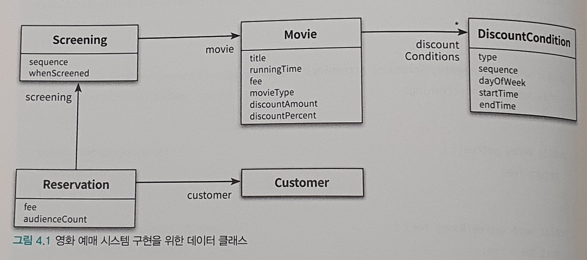

# 설계 품질과 트레이드오프

- 객체지향 설계는 올바른 객체에게 올바른 책임을 할당하면서 낮은 결합도와 높은 응집도를 가진 구조를 창조하는 것이다.
    - 객체지향 설계의 핵심은 책임이다.
    - 책임을 할당하는 작업은 응집도와 결합도 등 설계 품질과 깊은 연관이 있다.
- 객체의 상태가 아니라 행동에 초점을 맞춘다.

## 데이터 중심의 영화 설계 시스템

- 데이터(상태) 관점의 객체
    - 객체의 데이터를 조작하는 오퍼레이션을 정의한다.
    - 객체 상태에 초점을 맞춘다.
    - 객체를 독립된 데이터 덩어리로 바라본다.
- 책임 관점의 객체
    - 다른 객체가 요청할 수 있는 오퍼레이션을 위해 필요한 상태를 정의한다.
    - 객체의 행동에 초점을 맞춘다.
    - 객체를 협력하는 공동체의 일원으로 바라본다.
    
객체의 상태는 구현에 속하기 때문에 변경에 취약하므로 책임에 초점을 맞춰야 한다.

### 데이터를 준비하자

```java
public class Movie {
    private String title;
    private Duration runningTime;
    private Money fee;
    private List<DiscountCondition> discountConditions;
    
    private MovieType movieType;
    private Money discountAmount;
    private double discountPercent;
}
```

이전과 달리 discountConditions와 discountAmount, discountPercent가 Movie에 직접 포함된다.

```java
public enum MovieType {
    AMOUNT_DISCOUNT,
    PERCENT_DISCOUNT,
    MOVIE_DISCOUNT
}
```

이제 금액 할인인지 비율 할인인지는 movieType에 따라 결정된다.

- 객체에 포함해야 하는 데이터가 무엇인지에 대한 질문이 계속 된다면 데이터 중심 설계일 확률이 높다.
- 객체의 종류를 저장하는 인스턴스 변수(movieType)와 인스턴스 종류에 따라 사용될 인스턴스 변수(discountAmount, percent)를 한 클래스에 포함시키는 방식은 데이터 중심 설계에서 많이 보인다.

```java
public class Movie {
    ...
    
    public MovieType getMovieType() {
        return movieType;
    }
    
    public boid setMovieType(MovieType movieType) {
        this.movieType = movieType;
    }
    
    ...
}
```

캡술화를 위해 getter와 setter를 정의한다.

```java
import java.time.DayOfWeek;
import java.time.LocalTime;

public class DiscountCondition {
  private DiscountConditionType type;

  private int sequence;

  private DayOfWeek dayOfWeek;
  private LocalTime startTime;
  private LocalTime endTime;
  
  public DiscountConditionType getDiscountConditionType() {
      return type;
  }
  
  public void setDiscountConditionType() {
      this.type = type;
  }
  
  ...
}

public enum DiscountConditionType {
  SEQUENCE,
  PERIOD
}
```

순번 조건과 기간 조건 두 종류를 가진 할인 조건을 구현한다.

```java
import java.time.LocalDateTime;

public class Screening {
  private Movie movie;
  private int sequence;
  private LocalDateTime whenScreened;
  
  public Movie getMovie() {
      return movie;
  }
  
  public void setMovie(Movie movie) {
      this.movie = movie;
  }
  
  ...
}
```

```java
public class Reservation {
    private Customer customer;
    private Screening screening;
    private Money fee;
    private int audienceCount;
    
    ...
}
```

```java
public class Customer {
    private String name;
    private String id;
    
    ...
}
``` 

나머지 클래스도 구현한다.



전체적인 그림은 이렇다.