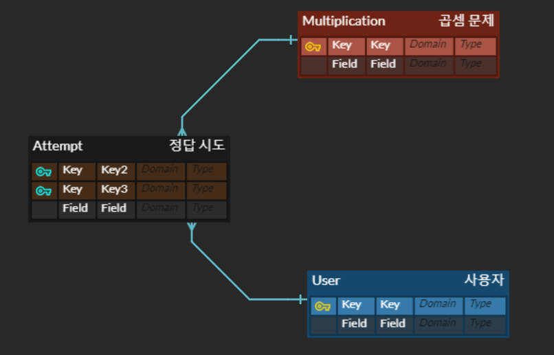

# 스프링부트를 활용한 마이크로서비스 개발

> 4월 3주차 기록  
> Ch 03 (56p~69p)

## 3. 3계층 스프링 부트 애플리케이션

본격적으로 데이터 계층에 대해 알아보자.

### 3-5-3. 데이터 레이어

* Hibernate 같은 ORM 프레임워크를 활용하면 Java 객체에 매핑할 수 있는 모델에 따라 데이터를 DB에 저장할 수 있다.
* 모델이 너무 복잡하지 않으면, ORM 프레임워크를 이용해 영속화 레이어를 간단하게 만들 수 있다.
* 예제가 간단하므로 Spring boot에서 제공하는 `Spring boot stater data jpa`를 활용해 JPA를 활용한다.
* JPA는 데이터를 영속화하는 명세이고 여러 구현체가 있다.(Hibernate가 그 중 하나)
* 특정 구현체에 종속되지 않게 표준을 사용하는 것이 좋다.

#### `pom.xml` 파일에 종속성 추가하기

``` xml
    <dependency>
        <groupId>org.springframework.boot</groupId>
        <artifactId>spring-boot-starter-data-jpa</artifactId>
    </dependency>

    <dependency>
        <groupId>com.h2database</groupId>
        <artifactId>h2</artifactId>
        <scope>runtime</scope>
    </dependency>
```

* `spring-boot-starter-data-jpa` 종속성을 추가하면 저장소를 쉽고 빠르게 만들 수 있는 스프링 데이터 JPA 툴을 사용할 수 있다.
* 이 종속성은 하이버네이트를 이용해 JPA를 구현한다.
* h2 아티팩트는 H2라는 가벼운 내장 DB를 포함한다. MySQL, PostgreSQL 등 다른 DB 엔진을 사용할 수 있지만, 요구사항에 적합하고 설명하기 쉬운 H2를 사용한다.

#### `application.properties` 설정 추가하기

``` yaml
# H2 데이터베이스 웹 콘솔에 접속
spring.h2.console.enabled=true
# 데이터베이스가 '없는 경우에만' 데이터베이스를 생성
spring.jpa.hibernate.ddl-auto=update
# 파일로 데이터베이스를 생성
spring.datasource.url=jdbc:h2:file:~/social-multiplication;DB_CLOSE_ON_EXIT=FALSE;
# 학습 목적으로 콘솔에 SQL을 출력
spring.jpa.properties.hibernate.show_sql=true
```

* yaml 포맷으로 사용하고 싶다면 `yml`로 파일명을 변경하고 내용을 조금만 수정해주면 된다.

> 실 운영을 준비한다면 MySQL 등 다른 DB로 설정해주는게 더 좋을 것 같다!

### 3-5-4. 데이터 모델

영속화 레이어를 완성하기 위해 데이터 모델을 설계한다.

앞서 비즈니스 개체를 정의했고, 데이터 관점에서 비즈니스 개체가 어떻게 연결되는지 고려해야한다.

* 데이터 모델이 도메인 모델과 일치하지 않을 수 있다!
* 예를 들면, **도메인**은 `CustomerWithPersonalDetails`와 `EmployeeWithPersonalDetails`로 나눈다.
* 하지만, 데이터 중복을 방지하고 공간을 절약하기 위해 **테이블**은 `customer`,       `employee`,       `personal_details`로 나눌 수 있다.

 

> 우리가 만드는 애플리케이션에서는 도메인 개체와 데이터 개체가 바로 매핑된다.  



복잡하지는 않지만 User 개체부터 살펴보자.

* 사용자는 여러 답안을 제출할 수 있다.
* 동시에 같은 숫자로 이뤄진 곱셈 문제에 여러 사용자가 답안을 제출할 수 있다.

#### JPA로 모델링해보기

애너테이션을 사용하면 쉽게 JPA로 모델링할 수 있다.

 `Multiplication 클래스`

``` Java
package microservices.book.multiplication.domain;

import lombok.EqualsAndHashCode;
import lombok.Getter;
import lombok.RequiredArgsConstructor;
import lombok.ToString;

import javax.persistence.Column;
import javax.persistence.Entity;
import javax.persistence.GeneratedValue;
import javax.persistence.Id;

/**
 * 애플리케이션에서 곱셈을 나타내는 클래스 (a * b)
 */
@RequiredArgsConstructor
@Getter
@ToString
@EqualsAndHashCode
@Entity
public final class Multiplication {

  @Id
  @GeneratedValue
  @Column(name = "MULTIPLICATION_ID")
  private Long id;

  // 두 인수
  private final int factorA;
  private final int factorB;

  // JSON/JPA 를 위한 빈 생성자
  Multiplication() {
    this(0, 0);
  }
}
```

* @Entity 에너테이션으로 JPA저장소에 저장할 수 있는 JPA 개체임을 명시!
* JPA에서 리플렉션을 통해 객체를 인스턴스화할 때 필요한 기본생성자 작성 필수
* 기본키로 유일한 식별자를 사용하기 위해 자바 Long 클래스 활용
* @Id : 기본키
* @GeneratedValue : AutoIncrement와 같이 자동으로 생성
* @Column : 컬럼명 설정 가능

 `User 클래스`

``` Java
package microservices.book.multiplication.domain;

import lombok.EqualsAndHashCode;
import lombok.Getter;
import lombok.RequiredArgsConstructor;
import lombok.ToString;

import javax.persistence.Column;
import javax.persistence.Entity;
import javax.persistence.GeneratedValue;
import javax.persistence.Id;

/**
 * 사용자 정보를 저장하는 클래스
 */
@RequiredArgsConstructor
@Getter
@ToString
@EqualsAndHashCode
@Entity
public final class User {

  @Id
  @GeneratedValue
  @Column(name = "USER_ID")
  private Long id;

  private final String alias;

  // JSON/JPA 를 위한 빈 생성자
  protected User() {
    alias = null;
  }
}
```

다른 개체들과 연결돼 있는 `MultiplicationResultAttempt` 클래스를 살펴보자.

``` Java
package microservices.book.multiplication.domain;

import lombok.EqualsAndHashCode;
import lombok.Getter;
import lombok.RequiredArgsConstructor;
import lombok.ToString;

import javax.persistence.*;

/**
 * {@link User}가 {@link Multiplication}을 계산한 답안을 정의한 클래스
 */
@RequiredArgsConstructor
@Getter
@ToString
@EqualsAndHashCode
@Entity
public final class MultiplicationResultAttempt {

  @Id
  @GeneratedValue
  private Long id;

  @ManyToOne(cascade = CascadeType.PERSIST)
  @JoinColumn(name = "USER_ID")
  private final User user;

  @ManyToOne(cascade = CascadeType.PERSIST)
  @JoinColumn(name = "MULTIPLICATION_ID")
  private final Multiplication multiplication;
  private final int resultAttempt;

  private final boolean correct;

  // JSON/JPA 를 위한 빈 생성자
  MultiplicationResultAttempt() {
    user = null;
    multiplication = null;
    resultAttempt = -1;
    correct = false;
  }

}
```

* JPA에는 개체 간의 관계를 명시하는 애너테이션인 `@OneToOne`, `@OneToMany`, `@ManyToOne`, `@ManyToMany` 존재
* 위와 같이 구성하면 답안 테이블은 User, Multiplication 테이블의 식별자에 대한 **외래키가 두 개** 생김! 
* @JoinColumn 애너테이션으로 다른 개체의 식별자를 참조

곱셈 문제를 풀어 답안을 제출했을 때 개체들이 각 테이블에서 다음과 같이 보여진다.

| USER_ID | ALIAS |
|:---|:---|
| 3 | John |

▲ USER 테이블

| MULTIPLICATION_ID | FACTOR A | FACTOR B |
|:---|:---|:---|
| 8 | 41 | 54 |

▲ MULTIPLICATION 테이블


| ID | CORRECT | RESULT_ATTEMPT | MULTIPLICATION_ID | USER_ID |
|:---|:---|:---|:---|:---|
| 11 | true | 2214 | 8 | 3 |

▲ MULTIPLICATION_RESULT_ATTEMPT 테이블


### 3-5-4. Repository

사전 준비가 끝났다! (영속성 구현 도구, 모델 설계)

이제 JPA 리포지토리를 만들어서 자바 객체를 저장하고 읽으면 된다.

애플리케이션 패키지 구조와 계층 구조 패턴을 따라 repository 패키지를 만들자.

`MultiplicationResultAttempt` 저장소

```java
package microservices.book.multiplication.repository;

import microservices.book.multiplication.domain.MultiplicationResultAttempt;
import org.springframework.data.repository.CrudRepository;

import java.util.List;

/**
 * 답안을 저장하고 조회하기 위한 인터페이스
 */
public interface MultiplicationResultAttemptRepository
        extends CrudRepository<MultiplicationResultAttempt, Long> {

  /**
   * @return 닉네임에 해당하는 사용자의 최근 답안 5개
   */
  List<MultiplicationResultAttempt> findTop5ByUserAliasOrderByIdDesc(String userAlias);
}
```

스프링 데이터 JPA 인터페이스를 상속받아 인터페이스를 만들면 그 안에 필요한 기능은 모두 다 있다!

객체에 대한 CRUD 기능을 가진 CrudRepository를 import 받았다.

- CrudRepository는 자바 Generics(제내릭)을 사용 -> 저장하려는 클래스(@Entity 클래스)와 식별자 타입을 인자로 넘겨줌
- PagingAndSortingRepository는 CRUD 기능 + 페이지와 정렬 기능까지 있는 유용한 인터페이스다!

> 스프링 데이터 JPA의 유용한 쿼리 메서드를 인터페이스로 추가하면 어느정도 쿼리는 모두 구현할 수 있다!  
> 자동 생성이 아니라면 직접 메서드를 만들고 @Query와 JPQA을 추가하면 된다!

`UserRepository`와 `MultiplicationRepository`도 스프링 데이터 JPA를 활용하면 금방 기능을 구현할 수 있다. 

`UserRepository`

```java
package microservices.book.multiplication.repository;

import microservices.book.multiplication.domain.User;
import org.springframework.data.repository.CrudRepository;

import java.util.Optional;

/**
 * {@link User}를 저장하고 조회하기 위한 인터페이스
 */
public interface UserRepository extends CrudRepository<User, Long> {

  Optional<User> findByAlias(final String alias);

}
```

`MultiplicationRepository`

```java
package microservices.book.multiplication.repository;

import microservices.book.multiplication.domain.Multiplication;
import org.springframework.data.repository.CrudRepository;

/**
 * {@link Multiplication}을 저장하고 조회하기 위한 인터페이스
 */
public interface MultiplicationRepository extends CrudRepository<Multiplication, Long> {
}
```

> Repository를 만들 때는 왜 TDD를 사용하지 않을까?  
> 새로운 코드가 아니라 스프링에서 제공되는 코드이기 때문에 단위 테스트를 작성할 필요가 없다!

이제 Repository를 사용해보자.

- 비즈니스 로직에서 개체를 저장하도록 처리해야한다.
- TDD로 돌아가서 답안을 검증하는 단위 테스트에 저장 로직을 추가하자.


`MultiplicationServiceImpl`

```java
// import 생략

@Service
class MultiplicationServiceImpl implements MultiplicationService {

  private RandomGeneratorService randomGeneratorService;
  private MultiplicationResultAttemptRepository attemptRepository;
  private UserRepository userRepository;

  @Autowired
  public MultiplicationServiceImpl(final RandomGeneratorService randomGeneratorService,
                                   final MultiplicationResultAttemptRepository attemptRepository,
                                   final UserRepository userRepository) {
    this.randomGeneratorService = randomGeneratorService;
    this.attemptRepository = attemptRepository;
    this.userRepository = userRepository;
  }

  @Override
  public Multiplication createRandomMultiplication() {
    int factorA = randomGeneratorService.generateRandomFactor();
    int factorB = randomGeneratorService.generateRandomFactor();
    return new Multiplication(factorA, factorB);
  }

  @Transactional
  @Override
  public boolean checkAttempt(final MultiplicationResultAttempt attempt) {
    // 해당 닉네임의 사용자가 존재하는지 확인
    Optional<User> user = userRepository.findByAlias(attempt.getUser().getAlias());

    // 조작된 답안을 방지
    Assert.isTrue(!attempt.isCorrect(), "채점한 상태로 보낼 수 없습니다!!");

    // 답안을 채점
    boolean isCorrect = attempt.getResultAttempt() ==
            attempt.getMultiplication().getFactorA() *
                    attempt.getMultiplication().getFactorB();

    MultiplicationResultAttempt checkedAttempt = new MultiplicationResultAttempt(
            user.orElse(attempt.getUser()),
            attempt.getMultiplication(),
            attempt.getResultAttempt(),
            isCorrect
    );

    // 답안을 저장
    attemptRepository.save(checkedAttempt);

    return isCorrect;
  }

  @Override
  public List<MultiplicationResultAttempt> getStatsForUser(String userAlias) {
    return attemptRepository.findTop5ByUserAliasOrderByIdDesc(userAlias);
  }

}
```

- 여기서 이해해야 할 중요한 개념은 Repository를 모두 사용할 필요가 없다는 점
  - MultiplicationResultAttempt 객체에서 CascadeType.PERSIST 라고 설정한 덕분에 답안을 저장하면 연결된 Multiplication과 User 객체도 영속화 된다.
- 하지만, 닉네임으로 사용자 정보를 확인하기 위해 UserRepository는 여전히 필요하다.
  - 자바 Optional을 이용하면 새로운 사용자인 경우(ID가 null)와 저장된 사용자의 경우 모두 `user.orElse(attempt.getUser())`를 이용해 처리할 수 있다.
