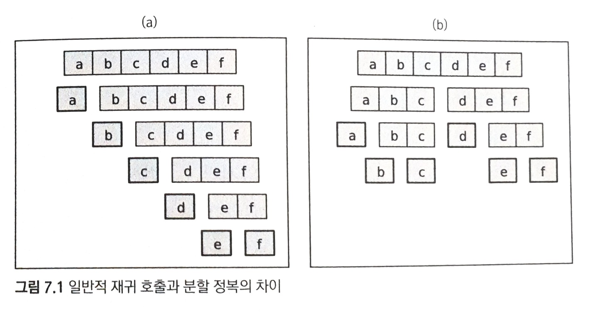
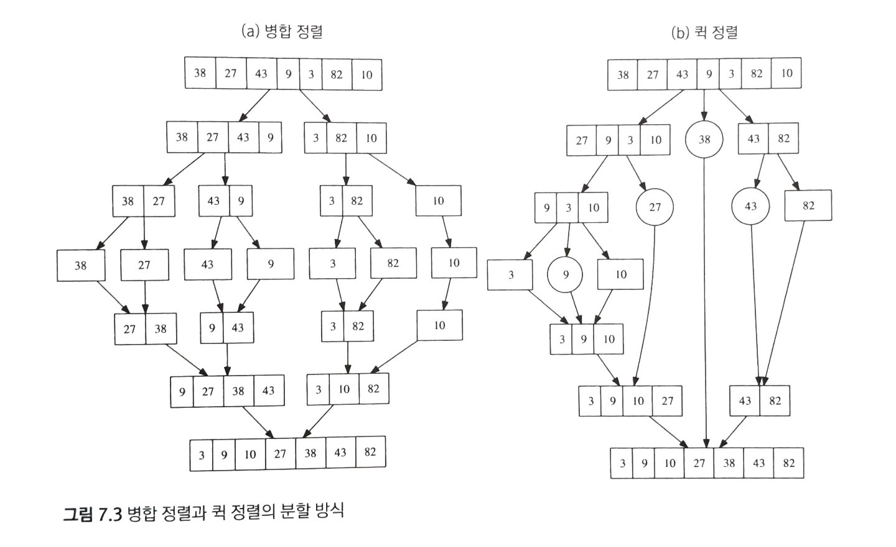

# 03 알고리즘 설계 패러다임 (상) (06 ~ 08)

## 06 무식하게 풀기

### 6.1 도입

흔히 전산학에서 '무식하게 푼다(brute-force)'는 말은 컴퓨터의 빠른 계산 능력을 이용해 가능한 경우의 수를 일일이 나열하면서 답을 찾는 방법을 의미한다.

이렇게 가능한 방법을 전부 만들어 보는 알고리즘들을 가리켜 흔히 완전탐색(exhaustive search)이라고 부른다. 얼핏 보면 이런 것을 언급할 가치가 있나 싶을 정도로 간단한 방법이지만, 완전탐색은 사실 컴퓨터의 장점을 가장 잘 이용하는 방법이다. 컴퓨터의 최대 장점은 속도가 빠르다는 것이기 때문이다.

### 6.2 재귀 호출과 완전 탐색

#### 재귀 호출

재귀 함수란 자신이 수행할 작업을 유사한 형태의 여러 조각으로 쪼갠 뒤 그 중 한 조각을 수행하고, 나머지를 자기 자신을 호출해 실행하는 함수를 가리킨다. 예를 들면 자연수 n이 주어졌을 때 1부터 n까지의 합을 반환하는 함수의 구현을 두 가지로 볼 수 있다.

```cpp
// 필수 조건 n >= 1
// 결과 : 1부터 n까지의 합을 반환한다.
int sum(int n) {
    int ret = 0;
    for(int i = 1; i <= n; ++i)
        ret += 1;
    return ret;
}

// 필수 조건 n >= 1
// 결과 : 1부터 n까지의 합을 반환한다.
int recursiveSum(int n) {
    if(n == 1) return 1; // 더이상 쪼개지지 않을 때
    return n + recursiveSum(n-1);
}
```
n개의 숫자의 합을 구하는 작업을 n개의 조각으로 쪼개, 더할 각 숫자가 하나의 조각이 되도록 한다. 재귀 호출을 이용하기 위해서는 이 조각 중 하나를 떼내어 자신이 해결하고, 나머지 조각들은 자기 자신을 호출해 해결해야 한다. recursiveSum()은 재귀 호출을 이용해 sum()을 구현한 함수이다. 모든 재귀 함수는 이와 같이 '더이상 쪼개지지 않는' 최소한의 작업에 도달했을 때 답을 곧장 반환하는 조건문을 포함해야 한다. 이 때 쪼개지지 않는 가장 작은 작업들을 가리켜 재귀 호출의 기저 사례(base case)라고 한다.

기저 사례를 선택할 때는 존재하는 모든 입력이 항상 기저 사례의 답을 이용해 계산될 수 있도록 신경써야 한다. 재귀 호출은 기존에 반복문을 사용해 작성하던 코드를 다르게 짤 수 있는 방법을 제공해 준다.

#### 예제: 중첩 반복문 대체하기

0번부터 차례대로 번호 매겨진 n개의 원소 중 네 개를 고르는 모든 경우를 출력하는 코드를 작성해 보자. 이는 4중 for문을 써서 간단하게 할 수 있다. 하지만 이 갯수가 5개, 6개 늘어나게 될 때 반복문은 점점 중첩되며 이는 입력값에 따라 유연하게 대응할 수 없다는 문제도 있다. 재귀 호출은 이런 경우 단순한 반복문보다 간결하고 유연한 코드를 작성할 수 있게 해준다.

해당 반복문이 하는 작업은 네 개의 조각으로 나눌 수 있다. 각 조각에서 하나의 원소를 고르는 것이다. 이렇게 원소를 고른 뒤, 남은 원소들을 고르는 작업을 자기 자신에게 호출해 떠넘기는 재귀 함수를 작성한다. 이 때 남은 원소들을 고르는 '작업'을 다음과 같은 입력들의 집합으로 정의할 수 있다.

- 원소들의 총 개수
- 더 골라야 할 원소들의 개수
- 지금까지 고른 원소들의 번호

아래 코드는 이 작업을 하는 재귀 함수를 보여준다.

```cpp
// n: 전체 원소의 수
// picked: 지금까지 고른 원소들의 번호
// toPick: 더 고를 원소의 수
void pick(int n, vector<int>& picked, int toPick) {
    // 기저 사례: 더 고를 원소가 없을 때 고른 원소들을 출력한다.
    if(toPick == 0) { printPicked(picked); return; }
    // 고를 수 있는 가장 작은 번호를 계산한다.
    int smallest = picked.empty() ? 0 : picked.back() + 1;
    // 이 단계에서 원소 하나를 고른다.
    for(int next = smallest; next < n; ++next) {
        picked.push_back(next);
        pick(n, picked, toPick - 1);
        picked.pop_back();
    }
}

```
이 재귀함수를 가지고 a,b,c,d 네 개의 원소 중 두 개의 원소를 고르는 경우는 다음 그림과 같이 탐색을 해서 찾을 수 있다.
하나씩 원소를 추가해 나가며, 하나의 답을 만든 뒤에는 이전으로 돌아가 다른 원소를 추가한다. 이와 같은 방식이면 n개의 원소 중 몇 개를 고르든지 사용할 수 있다.


### 6.3 문제: 소풍 (PICNIC, 난이도 하)

[문제](https://www.algospot.com/judge/problem/read/PICNIC)

이렇게 가능한 조합의 수를 계산하는 문제를 푸는 간단한 방법은 완전 탐색을 이용해 조합을 모두 만들어 보는 것이다. 재귀 호출을 이용해서 만들어 볼 수 있고, 이 과정에서 중복을 여러번 세는 부분을 주의해야 한다.

예를 들면 0번 학생과 1번 학생이 친구가 될 수 있을 때 (0,1),(1,0)은 하나로 세야 한다. 중복을 피하기 위해서 가장 쉬운 방법은 같은 답 중에 사전순으로 가장 먼저 오는 답만 세는 것이다. 여기서는 (0,1)을 세는 것처럼 말이다.

이 속성을 강제하기 위해서는 각 단계에서 남아있는 학생들 중 가장 번호가 빠른 학생의 짝을 찾아주도록 하면 된다.


구현 코드

```cpp
int n;
bool areFriends[10][10];
// taken[i] = i번째 학생이 이미 짝을 찾았으면 true, 아니면 false
int countPairings(bool taken[10]) {
    // 남은 학생들 중 가장 번호가 빠른 학생을 찾는다.
    int firstFree = -1;
    for(int i = 0; i < n; ++i) {
        if(!taken[i]) {
            firstFree = i;
            break;
        }
    }

    // 기저 사례: 모든 학생이 짝을 찾았으면 한 가지 방법을 찾았으니 종료한다
    if(firstFree == -1) return 1;
    int ret = 0;
    // 이 학생과 짝지을 학생을 결정한다.
    for(int pairWith = firstFree+1; pairWith < n; ++pairWith) {
        if(!taken[pairWith] && areFriends[firstFree][pairWith]) {
            taken[firstFree] = taken[pairWith] = true;
            ret += countPairing(taken);
            taken[firstFree] = taken[pairWith] = false;
        }
    }
    return ret;
}
```

### 6.7 최적화 문제

문제의 답이 하나가 아니라 여러 개이고, 그 중에서 어떤 기준에 따라 가장 '좋은' 답을 찾아 내는 문제들을 통칭해 최적화 문제(Optimization problem) 이라고 부른다.

예를 들어, n개의 원소 중에서 r개를 순서 없이 골라내는 방법의 수를 계산하는 것은 최적화 문제가 아니다. 우리가 원하는 답은 딱 하나밖에 없고, 더 좋은 답이나 덜 좋은 답이 없기 때문이다.

반면 n개의 사과 중에서 r개를 골라 무게의 합을 최적화 하는 문제, 아니면 가장 무거운 사과와 가장 가벼운 사과의 무게 차이를 최소화 하는 문제 등은 최적화 문제가 된다. 사과를 골라내는 방법은 여러 가지인데, 이 중 특정 기준에 의해 가장 좋은 답을 고르는 문제이기 때문이다.

#### 예제: 여행하는 외판원 문제

가장 유명한 최적화 문제 중 하나로 여행하는 외판원 문제(Traveling Salesman Problem, TSP)가 있다. n개의 도시가 있고 한 사람이 첫 번째 도시부터 모든 도시들을 탐험하는데 이동하는 거리이 최소가 되게 하는 문제이다. 각각의 도시들은 직선 도로로 연결되어 있다.

이 문제는 재귀 호출을 이용해서 간단하게 만들 수 있다. n개의 도시로 구성된 경로를 n개의 조각으로 나누어, 앞에서부터 도시를 하나씩 추가해 경로를 만들어 가는 것이다. 다음과 같은 함수를 작성해 이 문제를 해결할 수 있다.

*shortestPath(path) = path*가 지금까지 만든 경로일 때, 나머지 도시들을 모두 방문하는 경로들 중 가장 짧은 것의 길이를 반환한다.

아래 코드는 이 아이디어를 직접 구현한다. 단, 원래 우리가 생각했던 함수 형태와는 달리 각 정점을 방문했는지를 나타내는 boolean 값 배열 visited와 현재 경로의 길이 currentLength를 path와 함께 인자로 받고 있는 점을 유의한다.

```cpp
int n; // 도시의 수
double dist[MAX][MAX]; // 두 도시 간의 거리를 저장하는 배열
// path: 지금까지 만든 경로
// visited: 각 도시의 방문 여부
// currentLength: 지금까지 만든 경로의 길이
// 나머지 도시들을 방문하는 경로들 중 가장 짧은 것의 길이를 반환한다.
double shortestPath(vector<int>& path, vector<bool>& visited, double currentLength) {
    // 기저 사례: 모둔 도시를 다 방문했을 때는 시작 도시로 돌아가고 종료한다.
    if(path.size() == n)
        return currentLength + dist[path[0]][path.back()];
    double ret = INF; // 매우 큰 값으로 초기화
    // 다음 방문할 도시들을 전부 시도해 본다.
    for(int next = 0; next < n; ++next) {
        if(visited[next]) continue;
        int here = path.back();
        path.push_back(next);
        visited[next] = true;
        // 나머지 경로를 재귀 호출을 통해 완성하고 가장 짧은 경로의 길이를 얻는다.
        double cand = shortestPath(path, visited, currentLength + dist[here][next];
        ret = min(ret, cand);
        visited[next] = false;
        path.pop_back();
    }
    return ret;
}
```

## 07 분할 정복

### 7.1 분할 정복

분할 정복(Divide & Conquer)은 가장 유명한 알고리즘 디자인 패러다임으로, 각개 격파라는 말로 간단히 설명할 수 있다. *분할 정복 패러다임을 차용한 알고리즘들은 주어진 문제를 둘 이상의 부분 문제로 나눈 뒤 각 문제에 대한 답을 재귀 호출을 이용해 계산하고, 각 부분 문제의 답으로부터 전체 문제의 답을 계산해 낸다.*

분할 정복이 일반적인 재귀 호출과 다른 점은 문제를 한 조각과 나머지 전체로 나누는 대신 거의 같은 크기의 부분 문제로 나누는 것이다. 이 차이점이 아래 그림이다. 그림 (a)는 항상 문제를 한 조각과 나머지로 쪼개는 일반적인 재귀 호출 알고리즘을 보여주고, 그림 (b)는 항상 문제를 절반씩으로 나누는 분할 정복 알고리즘을 보여준다.



분할 정복을 사용하는 알고리즘들은 대개 세 가지의 구성 요소를 가지고 있다.

1. 문제를 더 작은 문제로 분할하는 과정(divide)
2. 각 문제에 대해 구한 답을 원래 문제에 대한 답으로 병합하는 과정(merge)
3. 더이상 답을 분할하지 않고 곧장 풀 수 있는 매우 작은 문제(base case)

분할 정복을 적용해 문제를 해결하기 위해서는 문제에 몇 가지 특성이 성립해야 한다. 문제를 둘 이상 부분 문제로 나누는 자연스러운 방법이 있어야 하며, 부분 문제의 답을 조합해 원래 문제의 답을 계산하는 효율적인 방법이 있어야 한다.

분할 정복의 장점은 많은 경우에 같은 작업을 더 빠르게 처리를 해 준다. 관련된 예제를 살펴 보도록 하자.

#### 예제: 수열의 빠른 합과 행렬의 빠른 제곱

1부터 n까지의 합을 구하는 함수 fastSum(n)을 분할정복을 가지고 만들어 보자.

fastSum(n) = 1 + 2 + 3 + ... + n
= (1 + 2 + ... + n/2) + ((n/2 + 1) + ... + n)
= fastSum(n/2) + ((n/2 + 1) + (n/2 + 2) + ... + (n/2 + n/2))
= fastSum(n/2) + (n/2)*(n/2) + (1 + 2 + ... + n/2)
= 2*fastNum(n/2) + n^2/4

따라서 다음과 같이 점화식을 만들 수가 있다.

fastSum(n) = 2*fastSum(n/2) + n^2/4 (단 n이 짝수일 때)

이 아이디어를 코드로 구현한 것이 다음과 같다.

```cpp
// 필수 조건: n은 자연수
// 1 + 2 + ... + n을 반환한다.
int fastSum(int n) {
    // 기저사례
    if(n == 1) return 1;
    if(n % 2 == 1) return fastSum(n-1) + n;
    return 2*fastSum(n/2) + (n/2)*(n/2);
}
```

여기에 소요된 시간복잡도는 얼마나 될까? 우리는 여기에서 fastSum()이 한 번 호출 될 때마다 최소한 두 번에 한 번 꼴로 n이 절반으로 줄어든다는 것을 알 수 있다. 따라서 N이 충분히 큰 수라 하면 분할 정복의 시간복잡도는 O(lgN)이 된다.

#### 예제: 병합 정렬과 퀵 정렬

주어진 수열을 크기 순서대로 정렬하는 문제는 전산학에서 가장 유명한 문제 중 하나이다. 이 문제를 해결하는 수 많은 알고리즘 중 가장 널리 쓰이는 것이 병합 정렬(Merge Sort)과 퀵 정렬(Quick Sort)이다. 이 두 알고리즘은 모두 분할 정복 패러다임을 기반으로 해서 만들어 졌다. 여기서는 직접적인 구현이나 증명은 생략하고 동작 원리와 시간 복잡도만을 알아 본다.

병합 정렬 알고리즘은 주어진 수열을 가운데에서 쪼개 비슷한 크기의 수열 두 개로 만든 뒤 이들을 재귀 호출해서 각각 정렬한다. 그 후 정렬된 배열을 하나로 합쳐서 전체 수열을 얻는다.

반대로 퀵 정렬 알고리즘은 배열을 단순히 가운데서 쪼개는 대신, 병합 과정이 필요 없도록 한쪽의 배열에 포함된 수가 다른 쪽 배열의 수보다 항상 작도록 배열을 분할한다. 이를 위해 퀵 정렬은 파티션(partition)이라 부르는 단계를 도입하는데, 이는 배열에 있는 수 중 임의의 '기준 수(pivot)'를 지정한 후 기준보다 작거나 같은 숫자를 왼쪽, 더 큰 숫자를 오른쪽으로 보내는 과정이다.

아래 그림은 병합 정렬과 퀵 정렬의 분할 방식을 보여주는 그림이다.



먼저 왼쪽의 동작 과정은 각 수열의 크기가 1이 될 때까지 절반씩 쪼개 나가고, 정렬된 부분 배열들을 합쳐 나가는 것을 볼 수 있다. 절반을 나누는 과정은 O(1), 나눠진 배열을 하나로 합치는 과정은 O(N)이 걸린다.

퀵 정렬은 각 부분 수열의 맨 처음에 있는 수를 기준으로 삼고, 이들보다 작은 수를 왼쪽으로, 큰 것을 오른쪽으로 가게끔 문제를 분해한다. 이 분할은 O(N)의 시간복잡도가 걸리고 기준을 어떻게 가져가느냐에 따라 비효율적일 수 있지만, 이로 인해 각 부분배열이 이미 정렬한 상태가 되어 별도의 병합 작업이 필요없다는 장점이 있다.

#### 시간 복잡도 분석

병합 정렬의 경우 한 단계에서 필요한 총 시간은 O(N)이고 이는 일정하다. 그리고 문제의 크기는 항상 거의 절반으로 나누어 지기 때문에, 필요한 단계의 수는 O(lgN)이 된다. 따라서 병합 정렬의 전체 시간복잡도는 O(NlgN)이 된다.

퀵 정렬의 경우 대부분의 시간을 차지하는 것은 주어진 문제를 두 개의 부분 문제로 나누는 부분이다. 병합 정렬과 달리 퀵 정렬의 시간 복잡도를 분석하기 어려운 것은 결과적으로 분할된 두 부분 문제가 비슷한 크기로 나눠진다는 보장을 할 수 없기 때문이다. 기준으로 택한 원소가 최소 원소나 최대 원소인 경우 부분 문제의 크기가 하나씩만 줄어들 수 있기 때문이다. 최악의 경우 퀵 정렬의 시간 복잡도는 O(N^2)이 된다. 다행히 평균적으로 부분 문제가 절반에 가깝게 나눠질 때 퀵 정렬의 시간 복잡도는 병합 정렬과 같은 O(NlgN)이 된다. 따라서 대부분의 퀵 정렬 구현은 가능한 한 절반에 가까운 분할을 얻기 위해 좋은 기준을 뽑는 다양한 방법들을 사용한다.
