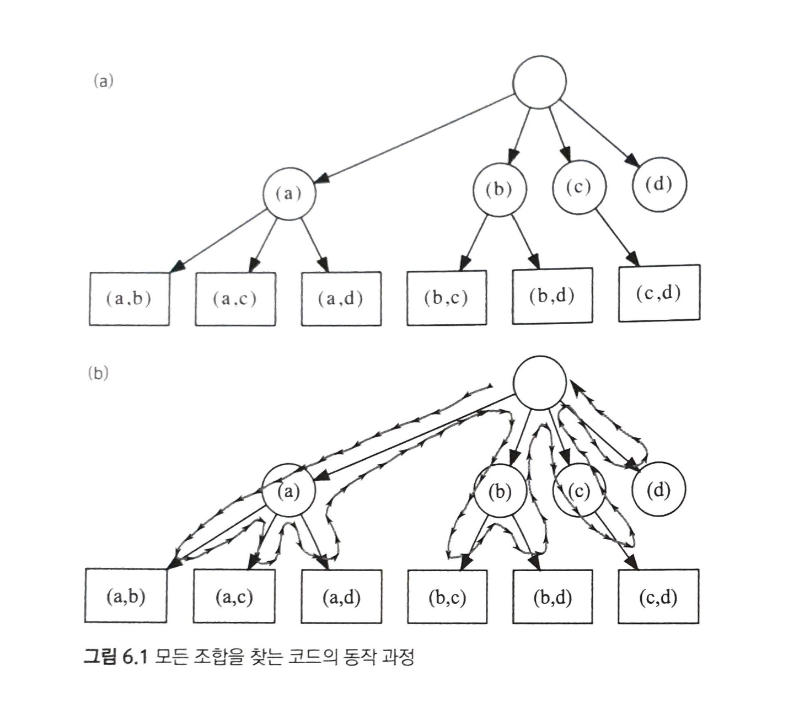
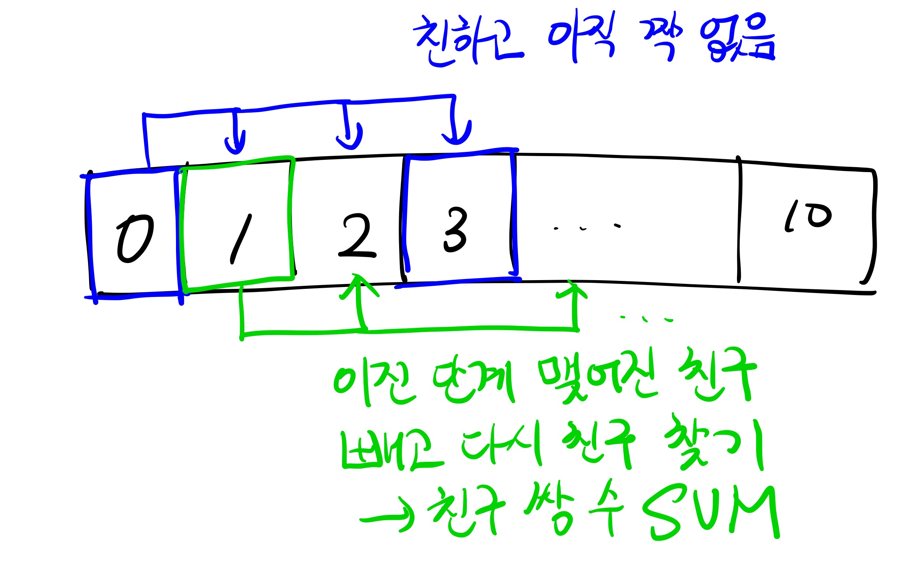

# 03 알고리즘 설계 패러다임 (상) (06 ~ 08)

## 06 무식하게 풀기

### 6.1 도입

흔히 전산학에서 '무식하게 푼다(brute-force)'는 말은 컴퓨터의 빠른 계산 능력을 이용해 가능한 경우의 수를 일일이 나열하면서 답을 찾는 방법을 의미한다.

이렇게 가능한 방법을 전부 만들어 보는 알고리즘들을 가리켜 흔히 완전탐색(exhaustive search)이라고 부른다. 얼핏 보면 이런 것을 언급할 가치가 있나 싶을 정도로 간단한 방법이지만, 완전탐색은 사실 컴퓨터의 장점을 가장 잘 이용하는 방법이다. 컴퓨터의 최대 장점은 속도가 빠르다는 것이기 때문이다.

### 6.2 재귀 호출과 완전 탐색

#### 재귀 호출

재귀 함수란 자신이 수행할 작업을 유사한 형태의 여러 조각으로 쪼갠 뒤 그 중 한 조각을 수행하고, 나머지를 자기 자신을 호출해 실행하는 함수를 가리킨다. 예를 들면 자연수 n이 주어졌을 때 1부터 n까지의 합을 반환하는 함수의 구현을 두 가지로 볼 수 있다.

```cpp
// 필수 조건 n >= 1
// 결과 : 1부터 n까지의 합을 반환한다.
int sum(int n) {
    int ret = 0;
    for(int i = 1; i <= n; ++i)
        ret += 1;
    return ret;
}

// 필수 조건 n >= 1
// 결과 : 1부터 n까지의 합을 반환한다.
int recursiveSum(int n) {
    if(n == 1) return 1; // 더이상 쪼개지지 않을 때
    return n + recursiveSum(n-1);
}
```
n개의 숫자의 합을 구하는 작업을 n개의 조각으로 쪼개, 더할 각 숫자가 하나의 조각이 되도록 한다. 재귀 호출을 이용하기 위해서는 이 조각 중 하나를 떼내어 자신이 해결하고, 나머지 조각들은 자기 자신을 호출해 해결해야 한다. recursiveSum()은 재귀 호출을 이용해 sum()을 구현한 함수이다. 모든 재귀 함수는 이와 같이 '더이상 쪼개지지 않는' 최소한의 작업에 도달했을 때 답을 곧장 반환하는 조건문을 포함해야 한다. 이 때 쪼개지지 않는 가장 작은 작업들을 가리켜 재귀 호출의 기저 사례(base case)라고 한다.

기저 사례를 선택할 때는 존재하는 모든 입력이 항상 기저 사례의 답을 이용해 계산될 수 있도록 신경써야 한다. 재귀 호출은 기존에 반복문을 사용해 작성하던 코드를 다르게 짤 수 있는 방법을 제공해 준다.

#### 예제: 중첩 반복문 대체하기

0번부터 차례대로 번호 매겨진 n개의 원소 중 네 개를 고르는 모든 경우를 출력하는 코드를 작성해 보자. 이는 4중 for문을 써서 간단하게 할 수 있다. 하지만 이 갯수가 5개, 6개 늘어나게 될 때 반복문은 점점 중첩되며 이는 입력값에 따라 유연하게 대응할 수 없다는 문제도 있다. 재귀 호출은 이런 경우 단순한 반복문보다 간결하고 유연한 코드를 작성할 수 있게 해준다.

해당 반복문이 하는 작업은 네 개의 조각으로 나눌 수 있다. 각 조각에서 하나의 원소를 고르는 것이다. 이렇게 원소를 고른 뒤, 남은 원소들을 고르는 작업을 자기 자신에게 호출해 떠넘기는 재귀 함수를 작성한다. 이 때 남은 원소들을 고르는 '작업'을 다음과 같은 입력들의 집합으로 정의할 수 있다.

- 원소들의 총 개수
- 더 골라야 할 원소들의 개수
- 지금까지 고른 원소들의 번호

아래 코드는 이 작업을 하는 재귀 함수를 보여준다.

```cpp
// n: 전체 원소의 수
// picked: 지금까지 고른 원소들의 번호
// toPick: 더 고를 원소의 수
void pick(int n, vector<int>& picked, int toPick) {
    // 기저 사례: 더 고를 원소가 없을 때 고른 원소들을 출력한다.
    if(toPick == 0) { printPicked(picked); return; }
    // 고를 수 있는 가장 작은 번호를 계산한다.
    int smallest = picked.empty() ? 0 : picked.back() + 1;
    // 이 단계에서 원소 하나를 고른다.
    for(int next = smallest; next < n; ++next) {
        picked.push_back(next);
        pick(n, picked, toPick - 1);
        picked.pop_back();
    }
}

```
이 재귀함수를 가지고 a,b,c,d 네 개의 원소 중 두 개의 원소를 고르는 경우는 다음 그림과 같이 탐색을 해서 찾을 수 있다.
하나씩 원소를 추가해 나가며, 하나의 답을 만든 뒤에는 이전으로 돌아가 다른 원소를 추가한다. 이와 같은 방식이면 n개의 원소 중 몇 개를 고르든지 사용할 수 있다.


### 6.3 문제: 소풍 (PICNIC, 난이도 하)

[문제](https://www.algospot.com/judge/problem/read/PICNIC)

이렇게 가능한 조합의 수를 계산하는 문제를 푸는 간단한 방법은 완전 탐색을 이용해 조합을 모두 만들어 보는 것이다. 재귀 호출을 이용해서 만들어 볼 수 있고, 이 과정에서 중복을 여러번 세는 부분을 주의해야 한다.

예를 들면 0번 학생과 1번 학생이 친구가 될 수 있을 때 (0,1),(1,0)은 하나로 세야 한다. 중복을 피하기 위해서 가장 쉬운 방법은 같은 답 중에 사전순으로 가장 먼저 오는 답만 세는 것이다. 여기서는 (0,1)을 세는 것처럼 말이다.

이 속성을 강제하기 위해서는 각 단계에서 남아있는 학생들 중 가장 번호가 빠른 학생의 짝을 찾아주도록 하면 된다.



구현 코드

```cpp
int n;
bool areFriends[10][10];
// taken[i] = i번째 학생이 이미 짝을 찾았으면 true, 아니면 false
int countPairings(bool taken[10]) {
    // 남은 학생들 중 가장 번호가 빠른 학생을 찾는다.
    int firstFree = -1;
    for(int i = 0; i < n; ++i) {
        if(!taken[i]) {
            firstFree = i;
            break;
        }
    }

    // 기저 사례: 모든 학생이 짝을 찾았으면 한 가지 방법을 찾았으니 종료한다
    if(firstFree == -1) return 1;
    int ret = 0;
    // 이 학생과 짝지을 학생을 결정한다.
    for(int pairWith = firstFree+1; pairWith < n; ++pairWith) {
        if(!taken[pairWith] && areFriends[firstFree][pairWith]) {
            taken[firstFree] = taken[pairWith] = true;
            ret += countPairing(taken);
            taken[firstFree] = taken[pairWith] = false;
        }
    }
    return ret;
}
```
