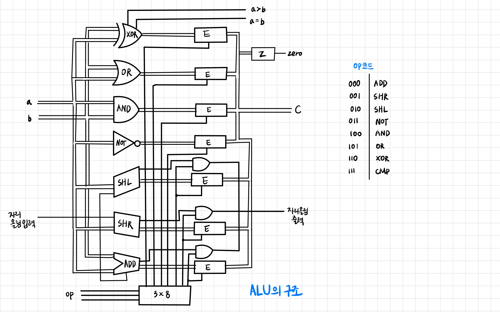

# Chapter 31 ~ 33 (133p~148p)

## 31. 산술 논리 장치

- Arithmetic and Login Unit => ALU

 

## 32. 제어 장치

- ALU의 출력은 ACC 레지스터에 연결되어 있다. ACC의 출력은 버스에 연결되어 있으므로 ALU 연산 결과가 필요한 어느 곳이든 보낼 수 있다.
- 램에는 3가지 제어 비트가 있다.
    1. MAR을 설정하는 비트
    2. 현재 선택된 바이트 데이터를 입력받기 위해 사용하는 비트
    3. 현재 선택된 바이트를 출력할지 여부를 선택하는 제어하는 비트

## 33. 클록

- 어떤 동작을 규칙적으로 반복할 때 그런 동작 하나를 일컬어 `사이클`이라고 부른다. 사이클은 시작 시각과 종료 시각 사이의 경과 시간이다.
- 헤르츠(Hz)는 1초에 전기가 얼마나 빨리 on/off 되는지 나타내는 단위이다.
- 아무런 입력없이 출력비트(클록비트)를 내보내는 것을 클록이라고 한다. `clk`
- 레지스터 간의 데이터 전송을 위해 두 가지 조건을 만족해야 한다.
    1. 목적지 레지스터가 입력 가능한 상태가 되기 전에 출발지 레지스터를 출력 가능한 상태로 바꿔 주어 데이터가 버스에 흐르고 있어야 한다.
    2. 출발지에서 버스로 흐르는 데이터를 목적지에 입력하기 전에 출발지 레지스터의 출력이 먼저 0이 되면 안된다.