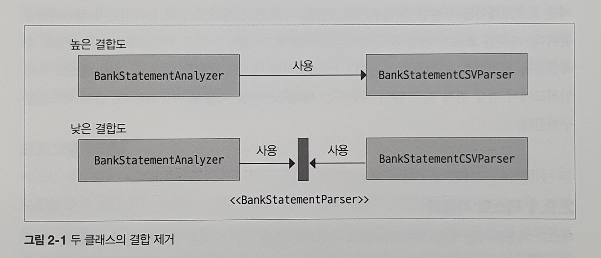

# 입출금 내역 분석기

## 요구 사항

은행 입출금 내역을 자동으로 분석해 재정 상태를 보여주는 소프트웨어를 개발한다. 거래 내역 예시는 다음과 같다.

```text
30-01-2017,-100,Deliveroo
30-01-2017,-50,Tesco
01-02-2017,6000,Salary
02-02-2017,2000,Royalties
02-02-2017,-4000,Rent
03-02-2017,3000,Tesco
05-02-2017,-30,Cinema
```

- 은행 입출금 내역의 총 수입과 총 지출
- 특정 달의 입출금 내역 건수
- 지출이 가장 높은 상위 10건
- 돈을 가장 많이 소비하는 항목

## 목표

- 단일 책임 원칙(SRP)
- 응집도
- 결합도

## KISS 원칙

- keep it short and simple

```java
public class BankTransactionAnalyzerSimple {

  private static final String RESOURCES = "src/main/resources/";

  public static void main(String[] args) throws IOException {
    final String fileName = "bank-data-simple.csv";
    // 파일 시스템 경로를 가져온다.
    final Path path = Paths.get(RESOURCES + fileName);
    // 행 목록을 반환한다.
    final List<String> lines = Files.readAllLines(path);

    double total = 0d;
    for (final String line : lines) {
      // 콤마로 열을 분리하고
      final String[] columns = line.split(",");
      // 금액을 추출해서 double로 파싱한다.
      final double amount = Double.parseDouble(columns[1]);

      // 최종 합계를 계산한다.
      total += amount;
    }

    System.out.println("total = " + total);
  }
}
```

```java
public class BankTransactionAnalyzerSimple {

  private static final String RESOURCES = "src/main/resources/";

  public static void main(String[] args) throws IOException {
    final String fileName = "bank-data-simple.csv";
    final Path path = Paths.get(RESOURCES + fileName);
    final List<String> lines = Files.readAllLines(path);

    double total = 0d;
    final DateTimeFormatter DATE_PATTERN = DateTimeFormatter.ofPattern("dd-MM-yyyy");

    for (final String line : lines) {
      final String[] columns = line.split(",");
      final LocalDate date = LocalDate.parse(columns[0], DATE_PATTERN);

      // 특정 달에 발생한 입출금 건수를 구한다.
      if (date.getMonth() == Month.JANUARY) {
        final double amount = Double.parseDouble(columns[1]);
        total += amount;
      }
    }

    System.out.println("total in January = " + total);
  }
}
```

CSV 파일을 프로그램의 명령줄 파라미터로 전달해 파싱한다. 이 프로그램은 정상 작동하지만 몇 가지 문제가 발생한다.

- 파일이 비어있다면?
- 데이터에 문제가 있어서 금액을 파싱하지 못한다면?
- 행의 데이터가 완벽하지 않다면?

### final 변수

- 변수에 값을 재할당할 수 없다.
- 어떤 객체의 상태가 바뀔 수 있는지 명확하게 구분할 수 있다.
    - 하지만 final이라도 가변 상태를 포함하기 때문에 무조건 객체가 바뀌지 못하는 건 아니다.
- 메서드 파라미터에 final을 붙여 해당 변수가 지역 변수가 아니며 재할당할 수 없음을 명시하기도 한다.
- 추상 메서드는 실제 구현이 없으므로 final이 쓸모없다.
- 자바 10에 var가 등장하면서 final의 유용성이 감소했다.

## 코드 유지보수성과 안티 패턴

### 유지보수성

- 특정 기능을 담당하는 코드를 쉽게 찾을 수 있어야 한다.
- 코드가 어떤 일을 수행하는지 쉽게 이해할 수 있어야 한다.
- 새로운 기능을 쉽게 추가하거나 기존 기능을 쉽게 제거할 수 있어야 한다.
- 캡슐화가 잘 되어있어야 한다.
    - 세부 구현을 감춰 사용자가 코드를 쉽게 이해하고 기능을 바꿀 수 있어야 한다.

### 안티 패턴

- 한 개의 거대한 갓 클래스 때문에 코드를 이해하기 어렵다.
- 코드 중복 때문에 코드가 불안정하고 변화에 쉽게 망가진다.

### 갓 클래스 안티 패턴

- 한 클래스로 모든 것을 해결하는 패턴

### 코드 중복

- DRY(don't repeat yourself) 원칙
    - 반복을 제거하면 로직을 바꿔도 여러 코드를 바꾸지 않아도 된다.
- 코드를 간결하게 하는 것도 좋지만 KISS를 남용하면 안된다.

## 단일 책임 원칙

- 한 클래스는 한 기능만 책임진다.
- 클래스가 바뀌는 이유는 오직 하나여야 한다.
- 클래스와 메서드에 적용한다.

```java
public class BankTransactionAnalyzerSimple {

  private static final String RESOURCES = "src/main/resources/";

  public static void main(String[] args) throws IOException {
    final String fileName = "bank-data-simple.csv";
    final Path path = Paths.get(RESOURCES + fileName);
    final List<String> lines = Files.readAllLines(path);

    double total = 0d;
    for (final String line : lines) {
      final String[] columns = line.split(",");
      final double amount = Double.parseDouble(columns[1]);

      total += amount;
    }

    System.out.println("total = " + total);
  }
}
```

지금의 클래스는 입력 읽기, 파싱, 결과 처리, 결과 요약이라는 여러 책임을 포함하고 있어 분리가 필요하다.

```java
public class BankStatementCSVParser {

  private static final DateTimeFormatter DATE_PATTERN = DateTimeFormatter.ofPattern("dd-MM-yyyy");

  private BankTransaction parseFromCSV(final String line) {
    final String[] columns = line.split(",");

    final LocalDate date = LocalDate.parse(columns[0], DATE_PATTERN);
    final double amount = Double.parseDouble(columns[1]);
    final String description = columns[2];

    return new BankTransaction(date, amount, description);
  }

  public List<BankTransaction> parseLinesFromCSV(final List<String> lines) {
    final List<BankTransaction> bankTransactions = new ArrayList<>();

    for (final String line : lines) {
      bankTransactions.add(parseFromCSV(line));
    }

    return bankTransactions;
  }

}
```

CSV 파싱 로직을 `BankStatementCSVParser`로 분리한다.

```java
public class BankTransaction {

  private final LocalDate date;
  private final double amount;
  private final String description;

  public BankTransaction(LocalDate date, double amount, String description) {
    this.date = date;
    this.amount = amount;
    this.description = description;
  }

  public LocalDate getDate() {
    return date;
  }

  public double getAmount() {
    return amount;
  }

  public String getDescription() {
    return description;
  }

  @Override
  public String toString() {
    return "BankTransaction{" +
        "date=" + date +
        ", amount=" + amount +
        ", description='" + description + '\'' +
        '}';
  }

  @Override
  public boolean equals(Object o) {
    if (this == o) {
      return true;
    }
    if (o == null || getClass() != o.getClass()) {
      return false;
    }
    BankTransaction that = (BankTransaction) o;
    return Double.compare(that.getAmount(), getAmount()) == 0 && Objects
        .equals(getDate(), that.getDate()) && Objects
        .equals(getDescription(), that.getDescription());
  }

  @Override
  public int hashCode() {
    return Objects.hash(getDate(), getAmount(), getDescription());
  }
}
```

`BankTransaction`은 입출금 내역을 표현하는 도메인 클래스다.

### 도메인

- 비즈니스 문제와 동일한 단어와 용어를 사용한다는 의미

```java
public class BankTransactionAnalyzerSimple {

  private static final String RESOURCES = "src/main/resources/";

  public static void main(String[] args) throws IOException {
    final BankStatementCSVParser bankStatementParser = new BankStatementCSVParser();
    final String fileName = "bank-data-simple.csv";
    final Path path = Paths.get(RESOURCES + fileName);
    final List<String> lines = Files.readAllLines(path);

    final List<BankTransaction> bankTransactions = bankStatementParser.parseLinesFromCSV(lines);

    System.out
        .println("The total for all transaction is " + calculateTotalAmount(bankTransactions));
    System.out.println(
        "The total for transaction in January " + selectInMonth(bankTransactions, Month.JANUARY));
  }

  public static double calculateTotalAmount(final List<BankTransaction> bankTransactions) {
    double total = 0d;

    for (final BankTransaction bankTransaction : bankTransactions) {
      total += bankTransaction.getAmount();
    }

    return total;
  }

  public static List<BankTransaction> selectInMonth(final List<BankTransaction> bankTransactions,
      final Month month) {
    final List<BankTransaction> bankTransactionsInMonth = new ArrayList<>();

    for (final BankTransaction bankTransaction : bankTransactions) {
      if (bankTransaction.getDate().getMonth() == month) {
        bankTransactionsInMonth.add(bankTransaction);
      }
    }

    return bankTransactionsInMonth;
  }
}
```

`BankStatementCSVParser`의 `parseLinesFromCSV()` 메서드를 사용하도록 리팩터링한다.

- `BankStatementCSVParser`가 `BankTransaction`에서 입출금 내역을 가져오기 때문에 파싱 방법을 직접 알 필요가 없어졌다.
- 새로운 기능이 생기면 `BankStatementCSVParser`에 구현해 재사용한다.
- `BankTransaction`이 생기면서 다른 코드가 특정 데이터 형식에 의존하지 않는다.

### 놀람 최소화 원칙

- 메서드가 수행하는 일을 바로 이해할 수 있는 메서드명을 사용한다.
    - ex) calculateTotalAmount()
- 다른 코드가 파라미터의 상태에 의존할 수 있으니 파라미터의 상태를 바꾸지 않는다.

## 응집도

- 서로 어떻게 관련되어 있는지를 말한다.
- 클래스나 메서드의 책임이 서로 얼마나 강하게 연결됐는지 측정한다.
- 높은 응집도를 목표로 해야한다.

```java
public class BankTransactionAnalyzerSimple {

  private static final String RESOURCES = "src/main/resources/";

  public static void main(String[] args) throws IOException {
    final BankStatementCSVParser bankStatementParser = new BankStatementCSVParser();
    final String fileName = "bank-data-simple.csv";
    final Path path = Paths.get(RESOURCES + fileName);
    final List<String> lines = Files.readAllLines(path);

    final List<BankTransaction> bankTransactions = bankStatementParser.parseLinesFromCSV(lines);

    System.out
        .println("The total for all transaction is " + calculateTotalAmount(bankTransactions));
    System.out.println(
        "The total for transaction in January " + selectInMonth(bankTransactions, Month.JANUARY));
  }

  public static double calculateTotalAmount(final List<BankTransaction> bankTransactions) {
    double total = 0d;

    for (final BankTransaction bankTransaction : bankTransactions) {
      total += bankTransaction.getAmount();
    }

    return total;
  }

  public static List<BankTransaction> selectInMonth(final List<BankTransaction> bankTransactions,
      final Month month) {
    final List<BankTransaction> bankTransactionsInMonth = new ArrayList<>();

    for (final BankTransaction bankTransaction : bankTransactions) {
      if (bankTransaction.getDate().getMonth() == month) {
        bankTransactionsInMonth.add(bankTransaction);
      }
    }

    return bankTransactionsInMonth;
  }
}
```

여기서 계산을 하는 `calculateTotalAmount()`와 `selectInMonth()`는 파싱, 결과 전송과는 관련이 없으므로 응집도가 떨어진다.

```java
public class BankStatementProcessor {

  // 입출금 내역 목록으로 연산하므로 이를 클래스 필드로 만들어 공유한다. 
  private final List<BankTransaction> bankTransactions;

  public BankStatementProcessor(List<BankTransaction> bankTransactions) {
    this.bankTransactions = bankTransactions;
  }

  public double calculateTotalAmount() {
    double total = 0d;

    for (final BankTransaction bankTransaction : bankTransactions) {
      total += bankTransaction.getAmount();
    }

    return total;
  }

  public double calculateTotalInMonth(final Month month) {
    double total = 0;

    for (final BankTransaction bankTransaction : bankTransactions) {
      if (bankTransaction.getDate().getMonth() == month) {
        total += bankTransaction.getAmount();
      }
    }

    return total;
  }

  public double calculateTotalForCategory(final String category) {
    double total = 0;

    for (final BankTransaction bankTransaction : bankTransactions) {
      if (bankTransaction.getDescription().equals(category)) {
        total += bankTransaction.getAmount();
      }
    }

    return total;
  }
}
```

`BankStatementProcessor`의 응집도가 높아졌다. 다른 클래스에서 `BankTransactionAnalyzer`없이도 해당 메서드를 재사용할 수 있다.

```java
public class BankTransactionAnalyzer {

  private static final String RESOURCES = "src/main/resources/";
  private static final BankStatementCSVParser bankStatementParser = new BankStatementCSVParser();

  public static void main(String[] args) throws IOException {
    final String fileName = "bank-data-simple.csv";
    final Path path = Paths.get(RESOURCES + fileName);
    final List<String> lines = Files.readAllLines(path);

    final List<BankTransaction> bankTransactions = bankStatementParser.parseLinesFromCSV(lines);
    final BankStatementProcessor bankStatementProcessor = new BankStatementProcessor(
        bankTransactions);

    collectSummary(bankStatementProcessor);
  }

  private static void collectSummary(final BankStatementProcessor bankStatementProcessor) {
    System.out
        .println(
            "The total for all transaction is " + bankStatementProcessor.calculateTotalAmount());

    System.out.println(
        "The total for transaction in January is " + bankStatementProcessor
            .calculateTotalInMonth(Month.JANUARY));

    System.out.println(
        "The total for transaction in February is " + bankStatementProcessor
            .calculateTotalInMonth(Month.FEBRUARY));

    System.out.println(
        "The total salary received is " + bankStatementProcessor
            .calculateTotalForCategory("Salary"));
  }
}
```

새로 만든 `BankStatementProcessor`를 적용하면 이렇게 된다.

### 클래스 수준 응집도

#### 기능

- 기능이 비슷한 메서드를 그룹화한다.
- 코드를 찾거나 이해하기 쉬워진다.
- 한 개의 클래스를 갖는 클래스를 너무 과도하게 만들 수 있다.
    - 고려할 클래스가 많아 장황하고 복잡해진다.

```java
public class BankStatementCSVParser {

  private static final DateTimeFormatter DATE_PATTERN = DateTimeFormatter.ofPattern("dd-MM-yyyy");

  private BankTransaction parseFromCSV(final String line) {
    ...

    return new BankTransaction(date, amount, description);
  }

  public List<BankTransaction> parseLinesFromCSV(final List<String> lines) {
    final List<BankTransaction> bankTransactions = new ArrayList<>();

    for (final String line : lines) {
      bankTransactions.add(parseFromCSV(line));
    }

    return bankTransactions;
  }

}
```

Parser에서 parseFrom()과 parseLinesFrom()을 묶은 덕분에 parseLinesFrom()이 parseFrom()을 사용할 수 있었다.

#### 정보

- 같은 데이터나 도메인 객체를 처리하는 메서드를 그룹화한다.
- 여러 기능을 그룹화하면서 필요한 일부 기능을 포함하는 클래스 전체를 의존하게 되는 단점이 있다.

```java
public class BankTransactionDAO {

  public BankTransaction create(final LocalDate date, final double amount,
      final String description) {
    throw new UnsupportedOperationException();
  }

  public BankTransaction read(final long id) {
    throw new UnsupportedOperationException();
  }

  public BankTransaction update(final Long id) {
    throw new UnsupportedOperationException();
  }

  public void delete(final BankTransaction bankTransaction) {
    throw new UnsupportedOperationException();
  }

}
```

`BankTransaction`객체의 CRUD 메서드를 모아놓았다.

#### 유틸리티

- 관련성이 없고 어디 속할지 결정하기 어려울 때 만능으로 모아둔다.
- 응집도가 낮아지므로 자제해야 한다.
- 관련성 없는 여러 메서드를 모아놓아 기능을 추론하기 어렵다.

#### 논리

```java
public class BankTransactionParser {

  public BankTransaction parseFromCSV(final String line) {
    throw new UnsupportedOperationException();
  }

  public BankTransaction parseFromJSON(final String line) {
    throw new UnsupportedOperationException();
  }

  public BankTransaction parseFromXML(final String line) {
    throw new UnsupportedOperationException();
  }
}
```

파싱이라는 논리로 그룹화되었다. 하지만 서로 본질적으로 다르고 메서드끼리 관련이 없다. 클래스가 4가지 책임을 갖게되므로 권장하지 않는 방법이다.

#### 순차

- 순차적으로 흐르는 동작을 모아둔다.
- 한 클래스를 바꿀 이유가 여러 가지로 존재하므로 SRP를 위배한다.
- 각기 구현 방법이 다르므로 클래스가 복잡해진다.
- 각 책임을 개별적으로 응집된 클래스로 분리하자.

파일을 읽고, 파싱하고, 처리하고, 정보를 저장하는 메서드를 한 클래스로 그룹화하는 방식이다.

#### 시간

- 시간과 관련된 연산을 그룹화한다.

DB 연결과 종료처럼 특정 작업 전후로 작업해야 하는 메서드를 모아둔 클래스를 예로 들 수 있다.

|종류|응집도 수준|장점|단점|
|----|------|---|---|
|기능|높은 응집도|이해하기 쉬움|너무 단순한 클래스 생성|
|정보|중간 응집도|유지보수하기 쉬움|불필요한 디펜던시|
|순차|중간 응집도|관련 동작을 찾기 쉬움|SRP를 위배할 수 있음|
|논리|중간 응집도|높은 수준의 카테고리화 제공|SRP를 위배할 수 있음|
|유틸리티|낮은 응집도|간단히 추가 가능|클래스의 책임을 파악하기 어려움|
|시간|낮은 응집도|판단 불가|각 동작을 이해하고 사용하기 어려움|

### 메서드 수준 응집도

- 다양한 기능을 수행할 수록 이해하기 어렵고 책임이 다양해 테스트도 힘들다.
- 파라미터의 필드를 바꾸는 if/else가 많다면 응집도가 낮으므로 더 작은 조각으로 분리해야 한다.

## 결합도

- 한 기능이 다른 클래스에 얼마나 의존하고 있는지 확인한다.
- 어떤 클래스를 구현하는 데 얼마나 많은 지식(다른 클래스)를 참조했는지 체크한다.

```java
public class BankTransactionAnalyzer {

  private static final BankStatementCSVParser bankStatementParser = new BankStatementCSVParser();

 ...
}
```

`BankTransactionAnalyzer`는 `BankStatementCSVParser`에 의존한다. 만약 CSV가 아니라 JSON으로 바꿔야한다면 리팩터링을 해야하는 것이다.

```java
public interface BankStatementParser {

  BankTransaction parseFrom(String line);

  List<BankTransaction> parseLinesFrom(List<String> lines);
}
```

인터페이스를 정의해 요구 사항이 바뀌어도 유연하게 상요할 수 있도록 수정한다.

```java
public class BankStatementCSVParser implements BankStatementParser {

  @Override
  public BankTransaction parseFrom(String line) {
   ...
  }

  @Override
  public List<BankTransaction> parseLinesFrom(List<String> lines) {
   ...
  }
}
```

`BankStatementCSVParser`는 `BankStatementParser`를 구현한다.

```java
public class BankTransactionAnalyzer {

  private static final String RESOURCES = "src/main/resources/";

  // BankStatementParser를 파라미터로 받는 analyze()를 새로 구현한다.
  public void analyze(final String fileName, final BankStatementParser bankStatementParser)
      throws IOException {
    final Path path = Paths.get(RESOURCES + fileName);
    final List<String> lines = Files.readAllLines(path);

    // 인터페이스를 사용해 특정 구현에 종속되지 않게 한다.
    final List<BankTransaction> bankTransactions = bankStatementParser.parseLinesFrom(lines);
    final BankStatementProcessor bankStatementProcessor = new BankStatementProcessor(
        bankTransactions);

    collectSummary(bankStatementProcessor);
  }

  private static void collectSummary(final BankStatementProcessor bankStatementProcessor) {
    ...
  }
}
```



이제 `BankTransactionAnalyzer`는 특정 구현에 종속되지 않아 변화에 잘 대응할 수 있다.

```java
public class MainApplication {

  public static void main(String[] args) throws IOException {
    final BankStatementAnalyzer bankStatementAnalyzer = new BankStatementAnalyzer();
    final BankStatementCSVParser bankStatementCSVParser = new BankStatementCSVParser();

    bankStatementAnalyzer.analyze(args[0], bankStatementCSVParser);
  }
}
```

`BankTransactionAnalyzer`에 있었던 메인 메서드를 옮겼다.

## 테스트 자동화

- 확신
    - 규격과 일치하게 동작하는지 확신할 수 있다.
    - 테스트가 곧 사양이 된다.

- 변화에도 튼튼함 유지
    - 코드를 바꿨을 때 다른 코드에 문제가 없는지 확인할 수 있다.

- 프로그램 이해도
    - 다양한 디펜던시와 상호작용을 명확하게 파악할 수 있다.
    - 새 프로젝트에 투입되었다면 자동화된 테스트부터 보면 좋다.

### 제이유닛 사용하기

- 테스트 코드도 정식 코드의 일부이므로 유지보수에 신경써야 한다.
- 메서드나 작은 클래스처럼 작고 고립된 단위로 테스트 하는 것을 유닛 테스트라고 한다.

### 테스트 메서드 정의하기

```java
class BankStatementCSVParserTest {

  private final BankStatementParser statementParser = new BankStatementCSVParser();

  @Test
  public void shouldParseOneCorrectLine() throws Exception {
    Assertions.fail("Not yet implemented");
  }

}
```

- 테스트 클래스 명에는 `Test`라는 접미어를 붙이는 것이 관습이다.
- 메서드 이름은 구현을 보지 않고도 쉽게 알 수 있도록 서술적으로 붙인다.
- `@Test`로 유닛 테스트의 대상임을 지정한다.

### Assertion 구문

```java
class BankStatementCSVParserTest {

  private final BankStatementParser statementParser = new BankStatementCSVParser();

  @Test
  public void shouldParseOneCorrectLine() throws Exception {
    final String line = "30-01-2017,-50,Tesco";
    final BankTransaction result = statementParser.parseFrom(line);

    final BankTransaction expected = new BankTransaction(LocalDate.of(2017, Month.JANUARY, 30), -50, "Tesco");

    Assertions.assertEquals(expected.getDate(), result.getDate());
    Assertions.assertEquals(expected.getAmount(), result.getAmount());
    Assertions.assertEquals(expected.getDescription(), result.getDescription());
  }

}
```

- 연산의 결과와 예상한 결과를 비교할 수 있다.
- given, when, then 패턴을 활용하자.

### 코드 커버리지

- 테스트 집합이 소스코드를 얼마나 테스트했는지 가리키는 척도
- 높을수록 버그 발생 확률이 낮아진다.
  - 70 ~ 90%를 유지하자.
  - 세터 같은 불필요한 코드도 있기에 100%는 무모하다.
- 커버리지가 높다고 폼질이 높은 것은 아니다. 그저 테스트할 부분이 남았음을 알려주는 역할이다.

## 총 정리

- 갓 클래스와 코드 중복은 코드를 추론하고 유지보수 하기 어렵게 만든다.
- SRP는 유지보수하기 쉬운 코드를 구현하게 해준다.
- 응집도는 클래스나 메서드의 책임이 얼마나 강하게 연관되어 있는지를 가리킨다.
- 결합도는 클래스가 달느 코드에 얼마나 의존하는지를 가리킨다.
- 높은 응집도와 낮은 결합도를 목표로 해야한다.
- 자동화된 테스트 스위트는 소프트웨어가 정상 동작하고 수정해도 잘 동작할 것임을 확신할 수 있으며, 프로그램을 쉽게 이해하게 해준다.
- 테스트는 given, when, then 패턴으로 분리하는 것이 좋다.