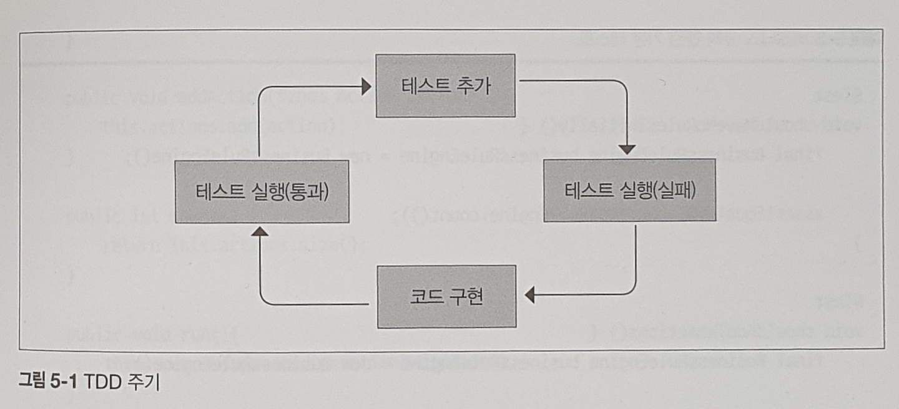
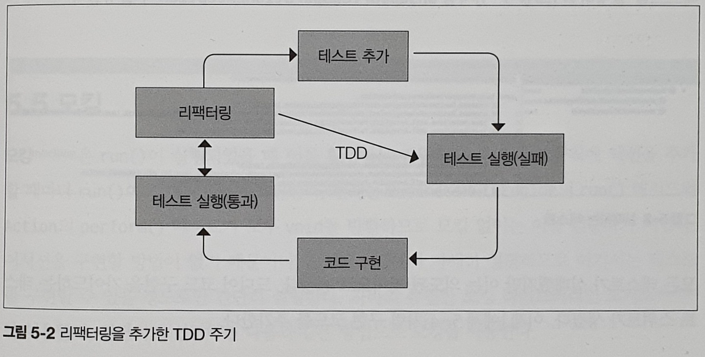

# 비즈니스 규칙 엔진

## 요구 사항

- 팩트
    - 규칙이 확인할 수 있는 정보
- 액션
    - 수행하려는 동작
- 조건
    - 액션을 언제 발생시킬지 지정
- 규칙
    - 실행하려는 비즈니스 규칙을 지정
    - 보통 팩트, 액션, 조건을 한 그룹으로 묶어 규칙으로 만듦

## 테스트 주도 개발

```java
public class BusinessRuleEngine {

  public void addAction(final Action action) {
    throw new UnsupportedOperationException();
  }

  public int count() {
    throw new UnsupportedOperationException();
  }

  public void run() {
    throw new UnsupportedOperationException();
  }

}
```

액션을 추가, 실행하는 기본 기능을 API로 나열하고 일단 예외를 던지게 한다.

```java

@FunctionalInterface
public interface Action {

  void execute();
}

```

실제 실행하는 부분을 만든다. 이렇게 비즈니스 규칙 엔진과 구체적 액션을 분리해 결합을 제거한다.

`Runnable` 인터페이스를 사용할 수도 있지만 도메인을 반영해 `Action`이라는 별도의 인터페이스를 만든다.

### TDD 사용 이유

- 별도의 테스트를 만들면서 필요한 요구사항에 집중할 수 있다.
- 코드를 올바르게 조작할 수 있다.
    - 테스트를 먼저 구현하면서 코드에 어떤 인터페이스를 만들지 신중하게 검토한다.
- 요구 사항 만족 여부를 조금 더 확신할 수 있다.
- 버그 발생 범위를 줄인다.
- 필요하지 않은 구현을 줄일 수 있다.

### TDD 주기



1. 실패하는 테스트 구현
2. 모든 테스트 실행
3. 기능이 동작하도록 코드 구현
4. 모든 테스트 실행



실제로는 코드를 항상 리팩터링해야 해서 이와같은 개선된 주기를 사용한다.

```java
class BusinessRuleEngineTest {

  @Test
  void shouldHaveNoRulesInitially() {
    final BusinessRuleEngine businessRuleEngine = new BusinessRuleEngine();

    assertEquals(0, businessRuleEngine.count());
  }

  @Test
  void shouldAddTwoActions() {
    final BusinessRuleEngine businessRuleEngine = new BusinessRuleEngine();

    businessRuleEngine.addAction(() -> {
    });
    businessRuleEngine.addAction(() -> {
    });

    assertEquals(2, businessRuleEngine.count());
  }
}
```

`count()`와 `addAction()`가 의도대로 예외를 발생시키는지 확인한다.

```java
public class BusinessRuleEngine {

  private final List<Action> actions;

  public BusinessRuleEngine() {
    this.actions = new ArrayList<>();
  }

  public void addAction(final Action action) {
    this.actions.add(action);
  }

  public int count() {
    return this.actions.size();
  }

  public void run() {
    throw new UnsupportedOperationException();
  }

}
```

이제 구현 코드를 구체화한다.

### 모킹

`run()` 메서드는 반환값이 없기 때문에 실행 여부를 확인하려면 모킹이 필요하다.

```java
class BusinessRuleEngineTest {

  @Test
  void shouldExecuteOneAction() {
    // given
    final BusinessRuleEngine businessRuleEngine = new BusinessRuleEngine();
    // mock 객체 생성
    final Action mockAction = mock(Action.class);

    businessRuleEngine.addAction(mockAction);

    // when
    businessRuleEngine.run();

    // then
    verify(mockAction).execute();
  }
}
```

## 조건 추가하기

```java
class BusinessRuleEngineTest {

  @Test
  void addActionWithAnonymousClass() {
    final BusinessRuleEngine businessRuleEngine = new BusinessRuleEngine();
    final Customer customer = new Customer("Mark", "CEO");

    businessRuleEngine.addAction(new Action() {
      @Override
      public void execute() {
        if ("CEO".equals(customer.getJobTitle())) {
          Mailer.sendEmail("sales@company.com", "Relevant customer: " + customer);
        }
      }
    });
  }
}
```

익명 클래스로 새로운 `Action`을 만들고 그 안에서 필요한 변수를 참조한다.

```java
class BusinessRuleEngineTest {

  @Test
  void addActionWithLambda() {
    final BusinessRuleEngine businessRuleEngine = new BusinessRuleEngine();
    final Customer customer = new Customer("Mark", "CEO");

    businessRuleEngine.addAction(() -> {
      if ("CEO".equals(customer.getJobTitle())) {
        Mailer.sendEmail("sales@company.com", "Relevant customer: " + customer);
      }
    });
  }
}
```

람다로 표현하는 것도 가능하다.

이 코드에는 두 가지 문제가 있다.

- `Action`의 테스트가 어렵다.
    - `customer`가 하드 코딩되어 코드가 독립적이지 않고 디펜던시를 가진다.
- `customer` 객체가 액션화 그룹화되어 있지 않다.
    - `customer` 객체는 여러 곳에 공유된 외부 상태다.
    - 의무가 여기저기 엉킬 수 있다.

따라서 `Action`에서 사용하는 상태를 캡슐화 해야한다. 이 항목을 `Facts`로 만든다.

```java
class BusinessRuleEngineTest {

  @Test
  void shouldPerformAnActionWithFacts() {
    final Action mockAction = mock(Action.class);
    final Facts mockFacts = mock(Facts.class);
    final BusinessRuleEngine businessRuleEngine = new BusinessRuleEngine(mockFacts);

    businessRuleEngine.addAction(mockAction);
    businessRuleEngine.run();

    verify(mockAction).execute(mockFacts);
  }
}
```

이제 하드 코딩된 `customer` 대신 `mockFacts`가 사용된다.

수정 사항이 실제 구현 코드에 반영되지 않았지만 일단 실행한다. 항상 처음에 테스트가 실패하는지 확인해야 우연히 통과하는 테스트를 피할 수 있다.

```java
public class Facts {

  private Map<String, String> facts = new HashMap<>();

  public String getFact(String name) {
    return this.facts.get(name);
  }

  public void setFact(String name, String value) {
    this.facts.put(name, value);
  }

}
```

```java

@FunctionalInterface
public interface Action {

  void execute(Facts facts);
}
```

```java
public class BusinessRuleEngine {

  private final List<Action> actions;
  private final Facts facts;

  public BusinessRuleEngine(final Facts facts) {
    this.actions = new ArrayList<>();
    this.facts = facts;
  }

  public void addAction(final Action action) {
    this.actions.add(action);
  }

  public int count() {
    return this.actions.size();
  }

  public void run() {
    this.actions.forEach(action -> action.execute(facts));
  }

}

```

새로운 `Facts`를 `Action.execute()` 사용 시 넘긴다.

```java
class BusinessRuleEngineTest {

  @Test
  void shouldPerformAnActionWithLambda() {
    final Facts mockFacts = mock(Facts.class);
    final BusinessRuleEngine businessRuleEngine = new BusinessRuleEngine(mockFacts);

    // facts를 이용한 addAction()
    businessRuleEngine.addAction(facts -> {
      final String jobTitle = facts.getFact("jobTitle");

      if ("CEO".equals(jobTitle)) {
        final String name = facts.getFact("name");
        Mailer.sendEmail("sales@company.com", "Relevant customer: " + name);
      }
    });
  }
}
```

이제 테스트에 `Facts` 값 내용에 따라 로직을 구현한다.

### 지역 변수 형식 추론

```java
class Test {

  // 명시적 형식
  Map<String, String> facts = new HashMap<String, String>();

  // 형식 추론
  Map<String, String> facts = new HashMap<>();

}
```

- 다이아몬드 연산자
    - 컨텍스트에서 파라미터 타입을 알 수 있다면 제네릭의 타입 파라미터를 생략할 수 있다.
    - 예시의 왼쪽 할당문이 모두 String임을 알려주고 있다.

```java
class Test {

  // 명시적 형식
  Facts env = new Facts();

  // 형식 추론
  var env = new Facts();
}  
```

자바 10부터는 지역 변수에도 적용된다.

```java
class Test {

  final Facts env = new Facts();

  // var는 final이 아니기 때문에 다른 값을 할당할 수 있다.
  var env = new Facts();

  // final을 추가하면 재할당할 수 없다.
  final var env = Facts();
}  
```

형식 추론을 사용하면 구현 시간을 단축할 수 있다. 하지만 가독성에 문제가 없을 때에만 사용해야 한다.

### switch 문

```java
class BusinessRulEngineTest {

  @Test
  void shouldPerformAnActionWithLambda() {
    final Facts mockFacts = mock(Facts.class);
    final BusinessRuleEngine businessRuleEngine = new BusinessRuleEngine(mockFacts);

    businessRuleEngine.addAction(facts -> {
      var forecastedAmount = 0.0;
      var dealStage = Stage.valueOf(facts.getFact("stage"));
      var amount = Double.parseDouble(facts.getFact("amount"));

      switch (dealStage) {
        case LEAD:
          forecastedAmount = amount * 0.2;
          break;
        case EVALUATING:
          forecastedAmount = amount * 0.5;
          break;
        case INTERESTED:
          forecastedAmount = amount * 0.8;
          break;
        case CLOSED:
          forecastedAmount = amount;
          break;
      }

      facts.addFact("forecastedAmount", String.valueOf(forecastedAmount));
    });
  }
}
```

위 코드는 `break`을 빼먹을 경우 `fall through`되어 다음 블록이 실행된다.

```java
class BusinessRulEngineTest {

  @Test
  void shouldPerformAnActionWithLambda() {
    final Facts mockFacts = mock(Facts.class);
    final BusinessRuleEngine businessRuleEngine = new BusinessRuleEngine(mockFacts);

    businessRuleEngine.addAction(facts -> {
      var dealStage = Stage.valueOf(facts.getFact("stage"));
      var amount = Double.parseDouble(facts.getFact("amount"));

      var forecastedAmount = amount * switch (dealStage) {
        case LEAD -> 0.2;
        case EVALUATING -> 0.5;
        case INTERESTED -> 0.8;
        case CLOSED -> 1;
      };

      facts.addFact("forecastedAmount", String.valueOf(forecastedAmount));
    });
  }
}
```

새로운 `switch`는 소모 검사를 해서 모든 값을 `switch`에서 사용했는지 확인한다. 예를 들어 `CLOSED`를 처리하지 않았다면 컴파일 에러가 발생한다.

### 인터페이스 분리 원칙

`ConditionalAction`을 받아 `Inspector` 클래스에서 평가하고 `Report`를 반환하는 코드를 구현해보자.

```java
class InspectorTest {

  @Test
  public void inspectIneConditionEvaluatesTrue() {
    final Facts facts = new Facts();
    facts.addFact("jobTitle", "CEO");

    final ConditionalAction conditionalAction = new JobTitleCondition();
    final Inspector inspector = new Inspector(conditionalAction);

    final List<Report> reportList = inspector.inspect(facts);

    assertEquals(1, reportList.size());
    assertEquals(true, reportList.get(0).isPositive());
  }

  private static class JobTitleCondition implements ConditionalAction {

    @Override
    public boolean evaluate(Facts facts) {
      return "CEO".equals(facts.getFact("jobTitle"));
    }

    // 필요없는 메서드
    @Override
    public void perform(Facts facts) {
      throw new UnsupportedOperationException();
    }
  }

}
```

`perform()`은 비어있고 사용하지 않는 메서드다. 필요하지 않은 기능까지 가진 `ConditionalAction`과 결합되어 `perform()`에 의존하는 것이다.

인터페이스 분리 원칙은 다음을 충족해야 한다.

- 사용하지 않는 메서드에 의존하지 않는다.
- 인터페이스가 커지면 인터페이스 사용자는 불필요한 기능을 가지며 결합도를 높인다.
- 더 작은 개념으로 쪼개 응집도를 높여야 한다.

단일 책임 원칙과 비슷해보이지만 SRP는 설계에, ISP는 사용자 인터페이스에 초점을 둔다.

## 플루언트 API 설계

- 특정 도메인에 맞춰진 API
- 메서드 체이닝을 사용하면 복잡한 연산에도 사용할 수 있다.
    - ex. 자바 스트림, 스프링 Integration, jooq

### 도메인 모델링

비즈니스 규칙 프로그램은 특정 조건에서 어떤 작업을 하도록 규칙을 지정할 수 있다. 이 도메인에는 세 가지 개념이 있다.

- 조건
    - 어떤 팩트에 적용할 조건
    - 참이나 거짓을 반환
- 액션
    - 실행할 연산이나 코드 집합
- 규칙
    - 조건과 액션을 합친 것
    - 조건이 참일 때만 액션을 실행

조건과 규칙을 새로 정의하고 기존의 `Action`을 재활용해보자.

```java

@FunctionalInterface
public interface Condition {

  boolean evaluate(Facts facts);
}
```

조건을 구현한다.

```java

@FunctionalInterface
interface Rule {

  void perform(Facts facts);
}

class DefaultRule implements Rule {

  private final Condition condition;
  private final Action action;

  public DefaultRule(final Condition condition, final Action action) {
    this.condition = condition;
    this.action = action;
  }

  @Override
  public void perform(Facts facts) {
    if (condition.evaluate(facts)) {
      action.execute(facts);
    }
  }
}

```

규칙을 구현한다.

```java
class Test {

  @Test
  void shouldPerformAnActionWithInterface() {
    final Condition condition = (Facts facts) -> "CEO".equals(facts.getFact("jobTitle"));
    final Action action = (Facts facts) -> {
      var name = facts.getFact("name");
      Mailer.sendEmail("sales@company.com", "Relevant customer: " + name);
    };

    final Rule rule = new DefaultRule(condition, action);
  }
}
```

구현한 조건과 규칙은 위처럼 생성할 수 있다.

### 빌더 패턴

사용자가 직접 객체를 인스턴스화 해서 한 곳으로 모아야 하는 수동적인 코드를 개선해보자.

- 생성자의 파라미터를 분해한다.
- 각각을 파라미터로 받는 메서드로 분리한다.

```java
class DefaultRule implements Rule {

  private final Condition condition;
  private final Action action;

  public DefaultRule(final Condition condition, final Action action) {
    this.condition = condition;
    this.action = action;
  }
  ...
}
```

```java
public class RuleBuilder {

  private Condition condition;
  private Action action;

  // DefaultRule 객체의 조건 설정
  public RuleBuilder when(final Condition condition) {
    this.condition = condition;
    return this;
  }

  public RuleBuilder then(final Action action) {
    this.action = action;
    return this;
  }

  // DefaultRule 객체 생성
  public Rule createRule() {
    return new DefaultRule(condition, action);
  }

}

```

기존 `DefaultRule`을 빌더 패턴으로 변경한다.

```java
class Test {

  @Test
  void shouldPerformAnActionWithBuilder() {
    Rule rule = new RuleBuilder()
        .when(facts -> "CEO".equals(facts.getFact("jobTitle")))
        .then(facts -> {
          var name = facts.getFact("name");
          Mailer.sendEmail("sales@company.com", "Relevant customer: " + name);
        })
        .createRule();
  }
}
```

이제 `RuleBuilder()`를 만들어 `when()` - `then()` - `createRule()`로 이어지는 매서드 체이닝을 사용한다. 앞서 정의했던 도메인 용어인
조건, 액션, 규칙을 활용했다.

이 코드의 문제점은 다음과 같다.

- 빈 `RuleBuilder`의 인스턴스 생성
- `createRule()` 메서드 호출

세 가지 방법으로 문제를 해결할 수 있다.

- 명시적으로 생성자를 호출하지 못하도록 생성자를 비공개로 한다.
    - API에 다른 진입점을 만들어야 한다.
- `when()`을 static으로 만들어 호출할 떄 예전 생성자를 호출하도록 한다.
    - static이면 `Rule` 객체를 설정할 때 어떤 메서드를 쓸지 쉽게 알 수 있다.
- `then()`이 `DefaultRule`의 생성까지 책임진다.

```java
public class RuleBuilder {

  private Condition condition;

  private RuleBuilder(final Condition condition) {
    this.condition = condition;
  }

  public static RuleBuilder when(final Condition condition) {
    return new RuleBuilder(condition);
  }

  // 생성까지 책임진다.
  public Rule then(final Action action) {
    return new DefaultRule(condition, action);
  }

}
```

```java
class Test {

  @Test
  void shouldPerformAnActionWithBuilder() {
    final Rule ruleSendEmailToSalesWhenCEO = RuleBuilder
        .when(facts -> "CEO".equals(facts.getFact("jobTitle")))
        .then(facts -> {
          var name = facts.getFact("name");
          Mailer.sendEmail("sales@company.com", "Relevant customer: " + name);
        });
  }
}
```

`then()`까지만 호출하면서 더욱 간단해졌다.