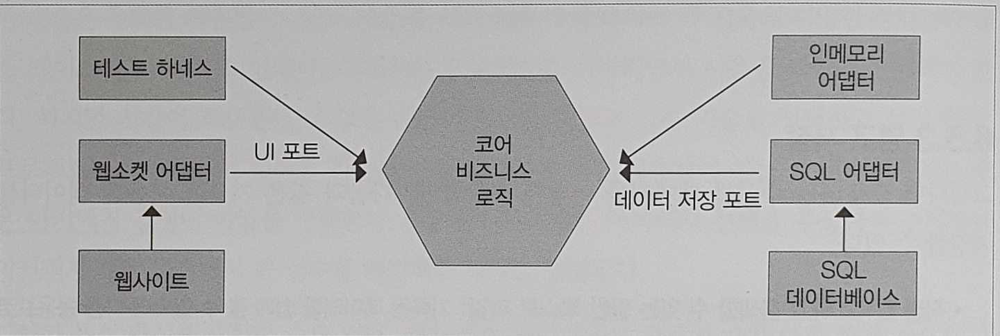

# 트우터
## 설계 개요

클라이언트-서버 모델로 구현한다.

### 풀 기반(pull-based, point-to-point, request-response)

- 클라이언트가 서버로 정보를 요청하고 가져온다.
- 클라이언트가 어떤 정보를 로딩할지 결정한다.
- ex. 관심 있는 페이지를 클릭한다.

### 푸시 기반(push-based, reactive, event-driven)

- 작성자(publisher)가 발행한 이벤트 스트림을 구독자가 수신한다.
- 일대일과 일대다 통신 모두 지원한다.
- 여러 컴포넌트 사이에 다양한 이벤트가 발생하는 상황에 사용한다.
- ex. 주식 앱에서 다양한 회사의 정보를 가져오려면 계속 요청하는 게 아니라 연속적으로 이벤트를 받는다.

트우터는 이벤트 주도가 적합하다. 풀 기반으로 하면 트웃 데이터를 정기적으로 요청해야 한다. 반면 이벤트 주도는 이벤트만 구독하면 관심있는 트웃을 서버가 클라이언트로 보낸다.

## 통신

### 웹 소켓

- TCP 스트림으로 양방향 통신을 지원한다.
- 웹 서버와 브라우저 사이의 이벤트 주도 통신에 사용된다.

SQS같은 클라우드 기반 메시지 큐를 많이 사용하는 추세다.  

## 육각형 아키텍처



- 포트
    - 코어 비즈니스 로직과 분리하려는 특정 기술에 사용
    - 이벤트는 포트를 통해 코어 로직으로 전달된다.
- 어댑터
    - 포트로 연결하는 특정 기술에 대한 구현 코드
- ex) UI 이벤트를 발행, 수신하는 포트 + 웹 소캣 어댑터

어떤 기능을 포트로 어떤 기능을 코어로 분리해야 하는지는 환경에 맞게 판단한다. 주로 비즈니스 문제를 해결하는데 꼭 필요한 기능을 코어로, 특정 기술에 종속된 기능은 외부로 분류한다.

포트와 어댑터는 코어와의 결합을 제거하는 것이므로 어댑터를 추상화해야 한다. 어댑터 클래스는 주로 여러 인터페이스를 구현할 가능성이 있으므로 추상 클래스보다 인터페이스를 사용한다.

인터페이스에 상태를 추가하면 서로 다른 내부 상태를 가지며 결합이 발생하므로, API에 상태를 추가하면 안된다.

## null

- null을 확인하지 않으면 NPE이 발생한다.
- 런타임 때만 발생하므로 컴파일 시점에는 이 문제를 피할 수 없다.
- 메서드 시그니처만으로 null이 의도적인지 아닌지 알 수 없다.
- 이런 경우 Optional을 사용하면 메서드 결과의 실패 여부를 명시적으로 표현할 수 있다.

## 도메인 모델

로그인 구현 시 유저 아이디를 키로, 비밀변호를 값으로 `Map<String, String>`에 저장할 수도 있다.

하지만 `사용자`는 도메인의 중요 개념이고 많은 시스템에서 사용하므로 `User`라는 도메인 클래스로 따로 빼야 한다. 따라서 `Map<String, User>`로 구현한다.

비즈니스 로직이 없으면서 여기저기 흩어져 있는 도메인 모델은 지양한다. 하지만 사용자 스토리가 항상 사용하는 개념이 있다면 도메인 모델로 표현하는 게 좋다.

## 비밀번호와 보안 

- 일반 텍스트
    - DB에 접근한 모든 사람이 확인할 수 있다.
- 암호화 해시 함수
    - DB에 접근해도 비밀번호를 읽을 수 없다.
    - 같은 값을 입력하면 같은 결과가 나온다.
    - 되돌리는 작업은 매우 오래 걸린다.

### 솔트

암호화 해시 함수는 무차별 대입(brute force)나 레인보우 테이블로 값을 되돌릴 가능성이 있다. 이에 대비해 임의의 값을 비밀번호에 추가해 막는 것을 말한다.

### 전송 계층 보안(TLS)

웹 소켓 연결 도중 중간자 공격을 막기 위해, 네트워크에 전달되는 데이터의 프라이버시와 무결성을 보장하는 암호화된 프로토콜이다.

## 팔로워와 트웃
### 소프트웨어 설계 기법

- 상향식
    - 데이터 저장이나 코어 도메인 등 코어 설계에서 시작하는 방법
    - ex) 데이터 모델링 후에 필요한 기능을 개발한다.
- 하향식
    - 요구 사항이나 스토리에서 시작해 필요한 기능을 먼저 개발하고 그 뒤에 저장소나 데이터 모델을 추가하는 방법
    - ex) API를 먼저 구현하고 저장 비즈니스 로직을 나중에 구현한다.
    
### enum

팔로우가 실패했을 때 처리할 수 있는 방법은 여러가지가 있다.

- 성공에는 void, 이외에는 예외를 던진다.
    - 예외적인 상황에서만 예외를 사용하는 게 좋으므로 피한다.
- 성공이면 true, 실패면 false를 반환한다.
    - 동작이 왜 실패했는지 알려줄 수 없다.
- int 상숫값으로 상황을 표현한다.
    - 오류 내용을 int로 만들면 그 자체에 오류가 생길 수 있다.
    - 안전한 형식으로 제공하기 어렵다.
    - 가독성과 유지보수성이 떨어진다.
- enum을 사용한다.
    - 형식이 안전하고 문서화가 된다.

```java
public enum FollowStatus {
  SUCCESS,
  INVALID_USER,
  ALREADY_FOLLOWING
}
```

### Mock 객체

- 다른 객체인 척 하는 객체
- 특정 메서드가 실제 호출되었는지 확인할 수 있다.

```java
class Test {
  @Test
  void verifyReceiverEndPoint() {
    Twoot twoot = new Twoot("id", "sender-id", "content", new Position());

    // mock 객체의 verify 메서드 활용
    verify(receiverEndPoint).onTwoot(twoot);
  }
}
```

### eqauls()와 hashCode() 메서드

```java
class Test {
  final Point p1 = new Point(1, 2);
  final Point p2 = new Point(1, 2);
}
```

두 객체는 참조 값이 다르므로 값이 같아도 다른 객체라고 판단한다. `equals()` 메서드를 오버라이드 해서 값이 같은지 비교할 수 있다. 

```java
public class Point {
  private final int x;
  private final int y;

  public Point(int x, int y) {
    this.x = x;
    this.y = y;
  }

  public int getX() {
    return x;
  }

  public int getY() {
    return y;
  }

  @Override
  public boolean equals(Object o) {
    if (this == o) {
      return true;
    }
    if (o == null || getClass() != o.getClass()) {
      return false;
    }
    Point point = (Point) o;

    if(x != point.getX()) return false;

    return y == point.getY();
  }

  @Override
  public int hashCode() {
    int result = x;
    result = 31 * result + y;

    return result;
  }
}
```

`equals()` 메서드로 같다고 판단한다면 `hashCode()`역시 같은 값을 반환해야한다는 규칙이 있으므로 `hashCode()`로 오버라이드 했다.

HashMap, HashSet 등 많은 자바 API가 `eqauls() & hashCode()` 계약을 준수한다. 좋은 해시 코드를 만들려면 계약을 준수하면서도 고르게 정숫값이 퍼져야 한다.

1. result 변수를 만들고 소수를 할당한다.
2. `equals()` 메서드가 사용하는 각 필드의 해시코드를 대표하는 int값을 계산한다.
3. 결과에 소수를 곱하고 필드의 해시 코드와 합친다.

예를 들어 `result = 41 * result + hashCodeOfField`가 될 수 있다.

보통은 `eqauls() & hashCode()`를 직접 구현하지 않고 IDE를 통해 자동으로 만든다.