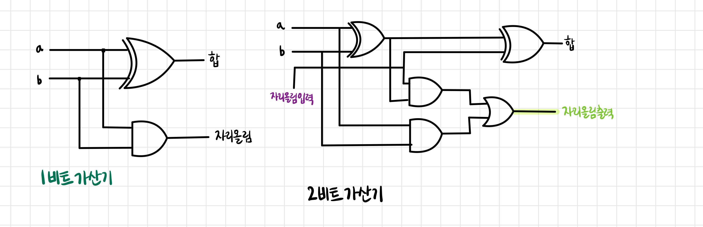

# Chapter 26 ~ 30 (~132p)

## 26. OR 장치

- 바이트 2개를 OR 연산하여 세 번째 바이트를 만들어 내는 장치
- 아스키코드의 알파벳 대문자와 소문자가 세번 째 비트의 부호만 다르게 설계되어 있으므로 OR 장치를 이용하면 쉽게 알파벳 대문자를 소문자로 변환할 수 있다.

## 27. XOR 장치

- 바이트 2개를 XOR 연산하여 세 번째 바이트를 만들어 내는 장치
- R1과 R2에 같은 패턴이 들어있다면 R1의 패턴이 무엇이든 XOR 연산의 결과는 항상 0이 된다.

## 28. 가산기

 

- 가산기를 이어 붙여서 큰 수를 만들어 내는 것도 가능하다.

## 29. 비교기와 제로 검사기

- 비교기(comparator)는 1바이트 크기가 아닌 오직 2비트 크기로 된 출력을 생성하는 장치
- XOR 장치는 1바이트 크기의 출력을, 비교기는 2비트 크기의 출력을 생성한다.
- 비교기의 기능
    1. 버스에서 들어오는 바이트 입력 2개가 정확히 같은지 판단
    2. 입력 2개가 다른지 판단
    3. 입력이 다르다면 a로 들어온 데이터가 b로 들어온 데이터보다 이진수로 큰 수인지 판단
- 바이트 안에 모든 비트에 대해 모든 XOR 게이트가 0이 되므로 입력이 같음을 확인한다.
- 값을 비교할 때는 최상위 비트에서부터 같은지 확인하고 같다면 하위비트를 비교한다.

 

- 1번 게이트 : a 입력과 b 입력이 같으면 0 출력, 다르면 1 출력
- 4번 게이트가 1이 되려면 `1. a와 b의 비트가 다름` `2. a 비트가 1이어야 함` `3. 이 지점 전까지 비교한 두 입력의 상위 모든 비트는 같아야 함` -> 한 가지라도 참이 아니면 4번은 0이 됨.
- 4번 게이트가 1이면 5번 게이트도 1이 된다.
- 제로 검사기는 바이트를 입력받아 1비트 정보를 출력한다. 1을 출력하면 입력 바이트가 모두 0이라는 것이다.

## 30. 논리

- 아리스토텔레스는 이렇게 논리적으로 사실 관계를 추리하는 부류의 학문을 논리학이라고 불렀다.