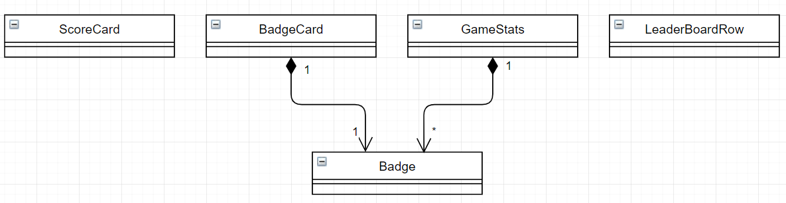

# 스프링부트를 활용한 마이크로서비스 개발

> 4월 5주차 기록 (2)  
> Ch 04 (104p~110p)

## 4. 마이크로서비스 시작하기

이전 `4-6 ~ 4-9`를 통해 **이벤트 중심 아키텍처**의 필요성 및 RabbitMQ의 장점, 실제 서비스로 적용하는 실습을 진행했다.

### 4-10. 게임화 마이크로서비스 살펴보기

새로운 게임화 마이크로서비스의 구현을 위해, `4-9`에서 수정한 곱셈 마이크로서비스의 이벤트를 어떻게 받는지 알아보자.

곱셈과 다른 프로젝트를 생성하여 애플리케이션 이름을 gamification으로 지정하고 microservices.book.gamification 패키지를 생성한다.

> 종속성은 Web, Lombok, H2, AMQP를 추가하면 된다.

#### 4-10-1. 도메인

게임화 도메인 모델을 이해해보자.

- ScoreCard : 주어진 사용자가 주어진 시간에 획득한 점수의 모델.
- Badge : 게임에서 사용하는 모든 배지
- BadgeCard : 특정 사용자가 특정 시간에 획득한 배지
- LeaderBoardRow : 리더보드(다른 사용자와 종합 스코어가 표시)
- GameStats : 주어진 사용자의 점수와 배지, 하나의 게임 결과 또는 점수와 배지 합산에 사용될 수 있음.

카드(점수와 배지)는 획득한 시간 정보를 포함한다. 게임의 결과는 하나 이상의 ScoreCard와 하나 이상의 BadgeCards를 포함한다.

  


도메인 클래스를 살펴보자.

gamification/src/main/java/microservices/book/gamification/domain/Badge.java

```java
/**
 * 사용자가 획득할 수 있는 여러 종류의 배지를 열거
 */
public enum Badge {

  // 점수로 획득하는 배지
  BRONZE_MULTIPLICATOR,
  SILVER_MULTIPLICATOR,
  GOLD_MULTIPLICATOR,

  // 특정 조건으로 획득하는 배지
  FIRST_ATTEMPT,
  FIRST_WON,
  LUCKY_NUMBER

}
```

gamification/src/main/java/microservices/book/gamification/domain/BadgeCard.java 

```java
import lombok.EqualsAndHashCode;
import lombok.Getter;
import lombok.RequiredArgsConstructor;
import lombok.ToString;

import javax.persistence.Column;
import javax.persistence.Entity;
import javax.persistence.GeneratedValue;
import javax.persistence.Id;

/**
 * 배지와 사용자를 연결하는 클래스
 * 사용자가 배지를 획득한 순간의 타임스탬프를 포함
 */
@RequiredArgsConstructor
@Getter
@ToString
@EqualsAndHashCode
@Entity
public final class BadgeCard {

  @Id
  @GeneratedValue
  @Column(name = "BADGE_ID")
  private final Long badgeId;

  private final Long userId;
  private final long badgeTimestamp;
  private final Badge badge;

  // JSON/JPA 를 위한 빈 생성자
  public BadgeCard() {
    this(null, null, 0, null);
  }

  public BadgeCard(final Long userId, final Badge badge) {
    this(null, userId, System.currentTimeMillis(), badge);
  }

}
```

gamification/src/main/java/microservices/book/gamification/domain/ScoreCard.java

```java
import lombok.EqualsAndHashCode;
import lombok.Getter;
import lombok.RequiredArgsConstructor;
import lombok.ToString;

import javax.persistence.Column;
import javax.persistence.Entity;
import javax.persistence.GeneratedValue;
import javax.persistence.Id;

/**
 * 점수와 답안을 연결하는 클래스
 * 사용자와 점수가 등록된 시간의 타임스탬프를 포함
 */
@RequiredArgsConstructor
@Getter
@ToString
@EqualsAndHashCode
@Entity
public final class ScoreCard {

  // 명시되지 않은 경우 이 카드에 할당되는 기본 점수
  public static final int DEFAULT_SCORE = 10;

  @Id
  @GeneratedValue
  @Column(name = "CARD_ID")
  private final Long cardId;

  @Column(name = "USER_ID")
  private final Long userId;

  @Column(name = "ATTEMPT_ID")
  private final Long attemptId;

  @Column(name = "SCORE_TS")
  private final long scoreTimestamp;

  @Column(name = "SCORE")
  private final int score;

  // JSON/JPA 를 위한 빈 생성자
  public ScoreCard() {
    this(null, null, null, 0, 0);
  }

  public ScoreCard(final Long userId, final Long attemptId) {
    this(null, userId, attemptId, System.currentTimeMillis(), DEFAULT_SCORE);
  }

}
```

gamification/src/main/java/microservices/book/gamification/domain/GameStats.java 

```java

import lombok.EqualsAndHashCode;
import lombok.Getter;
import lombok.RequiredArgsConstructor;
import lombok.ToString;

import java.util.ArrayList;
import java.util.Collections;
import java.util.List;

/**
 * 한 번 혹은 여러 번의 게임 결과를 포함하는 객체
 * {@link ScoreCard} 객체와 {@link BadgeCard} 로 이루어짐
 * 게임 한 번에 변경된 내용 또는 점수와 배지 전체를 나타낼 때 사용됨
 */
@RequiredArgsConstructor
@Getter
@ToString
@EqualsAndHashCode
public final class GameStats {

  private final Long userId;
  private final int score;
  private final List<Badge> badges;

  // JSON/JPA 를 위한 빈 생성자
  public GameStats() {
    this.userId = 0L;
    this.score = 0;
    this.badges = new ArrayList<>();
  }

  /**
   * 빈 인스턴스(0점과 배지 없는 상태)를 만들기 위한 팩토리 메소드
   *
   * @param userId 사용자 ID
   * @return {@link GameStats} 객체(0점과 배지 없는 상태)
   */
  public static GameStats emptyStats(final Long userId) {
    return new GameStats(userId, 0, Collections.emptyList());
  }

  /**
   * @return 수정불가능한 배지 카드 리스트의 뷰
   */
  public List<Badge> getBadges() {
    return Collections.unmodifiableList(badges);
  }
}
```
gamification/src/main/java/microservices/book/gamification/domain/LeaderBoardRow.java 

```java
import lombok.EqualsAndHashCode;
import lombok.Getter;
import lombok.RequiredArgsConstructor;
import lombok.ToString;

/**
 * 리더보드 내 위치를 나타내는 객체
 * 사용자와 전체 점수를 연결
 */
@RequiredArgsConstructor
@Getter
@ToString
@EqualsAndHashCode
public final class LeaderBoardRow {

  private final Long userId;
  private final Long totalScore;

  // JSON/JPA 를 위한 빈 생성자
  public LeaderBoardRow() {
    this(0L, 0L);
  }
}
```

