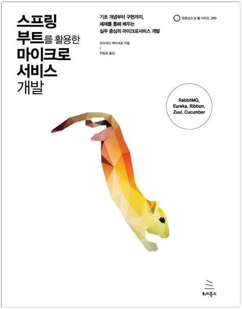

# 스프링부트를 활용한 마이크로서비스 개발

> ✨책 선정 이유  
> 회사 프로젝트에서 MSA를 Spring Boot 기반으로 개발하고 관리하다 보니 전반적인 MSA를 처음부터 구축하고 테스트해보며 이해하는게 필요하다고 생각했다.  
> 기존에는 Kafka, Spring Cloud Gateway 등 MSA를 구성하는 오픈소스를 활용한 프로젝트를 유지보수하고 분석하고 있는데 RabbitMQ와 Zuul도 사용해보고 장단점을 비교해볼 수 있을 것 같아 기대도 된다!

| [스프링부트를 활용한 마이크로서비스 개발](https://wikibook.co.kr/springboot-microservices/) |
|:---|
| 21.03~21.05 |
| 모이세스 메이세로 지음 |
| 한동호 옮김 |
| MSA, TDD, Eureka, Ribbon, Zuul, Cucumber |

작은 일체형부터 여러 서비스를 결합한 이벤트 중심 아키텍처까지 스프링 부트 애플리케이션을 조금씩 발전시켜 나가면서 마이크로서비스 아키텍처를 구축합니다. 이를 통해 마이크로서비스 아키텍처, 테스트 주도 개발, 유레카, 리본, 주울, 큐컴버를 이용한 엔드투엔드 테스트까지 차근차근 배울 수 있습니다.

저자인 모이세스 메이세로는 마이크로서비스 아키텍처의 이론적인 개념을 나열하는 대신 마이크로서비스의 장점을 실용적으로 설명합니다. 저자는 실용적인 관점에서 컴퓨터 프로그래밍의 최신 기술을 다룹니다. 중요한 것에 초점을 맞춰서 최소한의 실행 가능한 제품부터 시작하지만 더 다양하게 발전할 수 있는 유연함이 있습니다.

## 다루는 내용

- 스프링 부트를 이용한 마이크로서비스 구축
- 이벤트 중심 아키텍처와 RabbitMQ 메시징 활용
- 스프링을 이용한 RESTful 서비스 구축
- Eureka 서비스 디스커버리와 Ribbon 로드 밸런싱
- Zuul API 게이트웨이를 이용한 요청 라우팅
- Cucumber를 이용한 이벤트 중심 아키텍처의 엔드투엔드 REST 테스트 작성
- 지속적인 통합과 배포(CI/CD)
